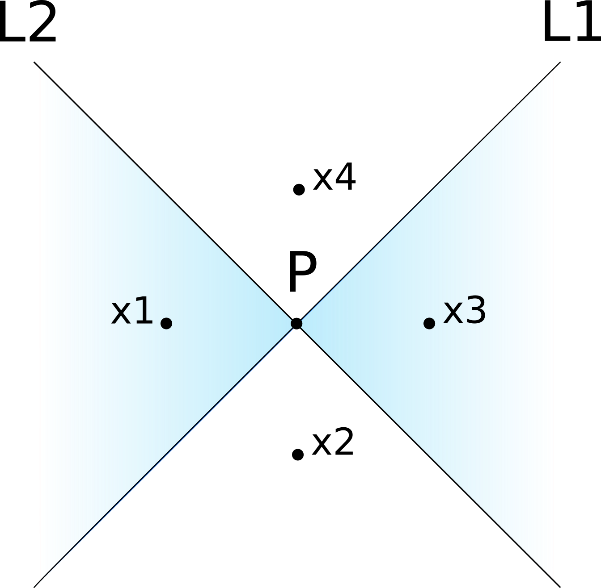

```{r setup, include=FALSE}
knitr::opts_chunk$set(eval = FALSE, echo = TRUE)
```


## Exercise 1
Consider a neural network with one hidden layer with threshold activation function (i.e., $\tau(x)=\mathbf{1}[x>0]$) and one output neuron with no activation function. Prove that such a neural network cannot _exactly_ separate the cyan ($y=1$) and white ($y=0$) areas in Figure 1.

{width=250px}

**Hint**: start by assuming that such a neural network exists and has two neurons in the hidden layer with a generic activation function $\tau(\cdot)$. Consider four points, one for each of the four regions, $\textbf{x}_1,\ldots,\textbf{x}_4$ with $y_2=y_4=0$ and $y_1=y_3=1$. Compute the difference between the predictions of points with different labels, $g(\textbf{x}_1)-g(\textbf{x}_2)$ and $g(\textbf{x}_4)-g(\textbf{x}_3)$. You should reach a contradiction, meaning that such a neural network does not exists.


<!--#!solutionbegin-->
### Solution
Assume that such a neural network exists. Then, it computes a function $g$ of the form:

$$
g(\textbf{x})=\sum_{i=1}^m w_i\cdot \tau(\textbf{x}^T\textbf{v}_i+c_i)+b
$$


Now consider four points as in Figure 2, so that $g(\textbf{x}_1)=g(\textbf{x}_3)=1$ and $g(\textbf{x}_2)=g(\textbf{x}_4)=0$. Moreover, assume that the first hidden neuron models $L_1$, so that it has a positive activation for $\textbf{x}_2$ and $\textbf{x}_3$, and zero for $\textbf{x}_1$ and $\textbf{x}_4$.

{width=250px}

The difference between the predictions for $\textbf{x}_1$ and $\textbf{x}_2$ is

\begin{align*}
g(\textbf{x}_1)-g(\textbf{x}_2)
&= \sum_{i=1}^m w_i\cdot \tau(\textbf{x}_1^T\textbf{v}_i+c_i)+b-\sum_{i=1}^m w_i\cdot \tau(\textbf{x}_2^T\textbf{v}_i+c_i)-b \\
&= w_1\cdot \tau(\textbf{x}_1^T\textbf{v}_1+c_1)-w_1\cdot \tau(\textbf{x}_2^T\textbf{v}_1+c_1) \\
& =w_1\cdot 0-w_1\cdot 1 \\
&= -w_1 = 1
\end{align*}

The second step follows because when going from $\textbf{x}_1$ to $\textbf{x}_2$ we only cross $L_1$, and we stay on the same side of every other line. The last step follows because we know that $g(\textbf{x}_1)=1$ and that $g(\textbf{x}_2)=0$. This allows us to conclude that $w_1=-1$.

The same reasoning applies to $\textbf{x}_4$ and $\textbf{x}_3$, too:

\begin{align*}
g(\textbf{x}_4)-g(\textbf{x}_3)
&=w_1\cdot \tau(\textbf{x}_4^T\textbf{v}_1+c_1)-w_1\cdot \tau(\textbf{x}_3^T\textbf{v}_1+c_1)) \\
&=-w_1 =-1
\end{align*}

Which implies that $w_1=1$. This contradicts what we found previously, hence no such neural network exists.

Note: this proof is presented in

Blum, Edward K., and Leong Kwan Li. 1991. “Approximation Theory and Feedforward Networks.” *Neural Networks* (4): 511–15. https://doi.org/10.1016/0893-6080(91)90047-9.7

<!--#!solutionend-->

## Exercise 2

In this exercise, we are going to create a neural network with two hidden layers and threshold activation that can correctly separate the cyan region from the rest in the plot below. We will do this by composing linear classifiers just like we did in the previous lab.

```{r eval=TRUE, echo=FALSE}
library(ggplot2)

bowtie = data.frame(x=c(-1, -1, 0, 1, 1, 0, -1), y=c(1, -1, 0, -1, 1, 0, 1))
ggplot(bowtie, aes(x=x, y=y)) +
  geom_polygon(fill='#b3cde3') +
  xlim(-2, 2) +
  ylim(-2, 2)
```

Let us create a dataset containing points on a grid to test the network:

```{r eval=TRUE}
# build a grid of equally-spaced points, plus a column for the bias
data = as.matrix(expand.grid(
  x0 = 1:1,
  x1 = seq(-2, 2, 1 / 25),
  x2 = seq(-2, 2, 1 / 25)
))

head(data)
```
### First hidden layer
The first hidden layer contains four neurons, each of which corresponds to a line in the plot below:

```{r eval=TRUE, echo=FALSE}
ggplot(bowtie, aes(x = x, y = y)) +
  geom_line(data = data.frame(x = c(-1.25, 1.25), y = c(1.25, -1.25))) +
  geom_line(data = data.frame(x = c(-1.25, 1.25), y = c(-1.25, 1.25))) +
  geom_line(data = data.frame(x = c(-1, -1), y = c(-1.5, 1.5))) +
  geom_line(data = data.frame(x = c(1, 1), y = c(-1.5, 1.5))) +
  xlim(-2, 2) +
  ylim(-2, 2)
```

The following functions visualizes the decision boundary of a neuron with sigmoid activation, $y=\sigma(a+bx_1+cx_2)$. You can use it to help you find the right values for the weights.

```{r}
library(scales)

plot_grid = function(predictions) {
  # plots the predicted value for each point on the grid;
  # the predictions should have one column and
  # the same number of rows (10,201) as the data
  df = cbind(as.data.frame(data), y = predictions)
  ggplot() +
    geom_tile(aes(x = x1, y = x2, fill = y, color = y), df) +
    scale_color_gradient2(low = muted("blue", 70), mid = "white",
                         high = muted("red", 70), limits = c(0, 1),
                         midpoint = 0.5) +
    scale_fill_gradient2(low = muted("blue", 70), mid = "white",
                        high = muted("red", 70), limits = c(0, 1),
                        midpoint = 0.5) +
    geom_line(aes(x = c(-1.25, 1.25), y = c(1.25, -1.25)), inherit.aes = F) +
    geom_line(aes(x = c(-1.25, 1.25), y = c(-1.25, 1.25)), inherit.aes = F) +
    geom_line(aes(x = c(-1, -1), y = c(-1.5, 1.5)), inherit.aes = F) +
    geom_line(aes(x = c(1, 1), y = c(-1.5, 1.5)), inherit.aes = F)
}

activation = function(x) {
  #!hwbegin TODO apply the threshold activation to x
  ifelse(x > 0, 1, 0)
  #!hwend
}

plot_decision_boundary_first_hidden = function(a, b, c) {
  neuron_output = (
    #!hwbegin TODO compute the output of the neuron with input weights\n# given by a, b and c on each point of the grid
    activation(data %*% c(a, b, c))
    #!hwend
  );
  plot_grid(neuron_output);
}

plot_decision_boundary_first_hidden(1, -2, 1)
```

For convenience, we group the parameters of the four neurons into a matrix with three rows and five columns (one is for the bias), so that their output can be computed in a single matrix multiplication. Each column contains the weights of a different neuron. The first column contains a "fake" hidden neuron for the bias, whose value is always one. Note that the first row of the weight matrix is connected to the bias of the previous layer.

```{r}
weights1 = matrix(c(
  1, 0, 0,   # bias neuron connected to the bias of the inputs
  #!hwbegin TODO find the coefficients for the first neuron
  1, -1, 0,
  #!hwend
  #!hwbegin TODO find the coefficients for the second neuron
  1, 1, 0,
  #!hwend
  #!hwbegin TODO find the coefficients for the third neuron
  0, 1, -1,
  #!hwend
  #!hwbegin TODO find the coefficients for the fourth neuron
  0, 1, 1
  #!hwend
), ncol = 5);

dim(weights1)
```

Let us plot the predictions of the four neurons:

```{r}
# make sure that the decision boundary of the neurons corresponds to the four lines
plot_decision_boundary_first_hidden(weights1[1, 2], weights1[2, 2], weights1[3, 2]);
plot_decision_boundary_first_hidden(weights1[1, 3], weights1[2, 3], weights1[3, 3]);
plot_decision_boundary_first_hidden(weights1[1, 4], weights1[2, 4], weights1[3, 4]);
plot_decision_boundary_first_hidden(weights1[1, 5], weights1[2, 5], weights1[3, 5]);
```

And this is the first hidden layer of the network. Let us compute its predictions for each point of the grid:

```{r}
hidden1 = (
  #!hwbegin TODO compute the output of the first hidden layer using a matrix multiplication
  activation(data %*% weights1)
  #!hwend
)

# make sure that the number of rows is not changed,
nrow(hidden1) == nrow(data)

# that there are five columns,
ncol(hidden1) == 5

# and that the values are between zero and one
range(hidden1)
```
### Second hidden layer
The second hidden layer is composed of two neurons, each activating for inputs inside one of the two triangles that make up our figure. These two neurons are connected to the four neurons of the previous layer, thus each of them has five parameters.

Let us first create a new function to visualize the decision boundary of these neurons in the second hidden layer.

```{r}
plot_decision_boundary_second_hidden = function(a, b, c, d, e) {
  neuron_output = (
    #!hwbegin TODO compute the output of the neuron
    activation(hidden1 %*% c(a, b, c, d, e))
    #!hwend
  );
  plot_grid(neuron_output);
}

plot_decision_boundary_second_hidden(-2, 3, -1, -3, 1);
```

Now, as before, find the coefficients for the two neurons and put them into a matrix with five rows and three columns. You can use the previous function to help you find these weights.

**Hint:** you can think of these neurons as performing a logical AND operation on the outputs of the neurons of the previous layer. All points inside each triangle must be on the same side of three decision boundaries.

```{r}
weights2 = matrix(c(
  1, 0, 0, 0, 0,  # bias neuron connected to the bias of the previous layer
  #!hwbegin TODO find the coefficients for the first neuron
  -5, 2, 0, 2, 2,
  #!hwend
  #!hwbegin TODO find the coefficients for the second neuron
  -1, 0, 2, -2, -2
  #!hwend
), ncol = 3)

dim(weights2)
```
The predictions:

```{r}
plot_decision_boundary_second_hidden(
  weights2[1, 2], weights2[2, 2], weights2[3, 2], weights2[4, 2], weights2[5, 2]
);
plot_decision_boundary_second_hidden(
  weights2[1, 3], weights2[2, 3], weights2[3, 3], weights2[4, 3], weights2[5, 3]
);
```

```{r}
hidden2 = (
  #!hwbegin TODO compute the output of the second hidden layer
  activation(hidden1 %*% weights2)
  #!hwend
)

# make sure that the number of rows is not changed,
nrow(hidden2) == nrow(data)

# that there are three columns,
ncol(hidden2) == 3

# and that the values are between zero and one
range(hidden2)
```
### Output layer
Finally, we can seek the parameters for the output neuron. It should activate when an input is inside either one of the two triangles.

**Hint:** you can think of the output neuron as performing a logical OR operation on the outputs of the second hidden layer.

Let us again modify the visualization function to show the decision of the network:

```{r}
plot_decision_boundary_output = function(a, b, c) {
  neuron_output = (
    #!hwbegin TODO compute the output of the neuron
    hidden2 %*% c(a, b, c)
    #!hwend
  );
  plot_grid(neuron_output);
}
```

Now fill in the parameters:

```{r}
weights3 = matrix(c(
  # no bias neuron this time
  #!hwbegin TODO find the coefficients for the output neuron
  0, 1, 1
  #!hwend
), ncol = 1)

dim(weights3)
```

The output of the neural network is:

```{r}
plot_decision_boundary_output(weights3[1, 1], weights3[2, 1], weights3[3, 1]);
```


Let us recap how the output is computed:

```{r}
hidden1 = activation(data %*% weights1)
hidden2 = activation(hidden1 %*% weights2)
output = hidden2 %*% weights3
```

This is, in essence, the *forward pass*.

If you did everything correctly, you should see below the bow tie image we wanted to reproduce:

```{r}
plot_grid(output)
```

## Exercise 3

**Note:** Focus on solving the second exercise first, as this exercise is of secondary importance. Essentially, it shows that the same function can be computed by many different neural networks.

Consider a neuron with incoming weights $\textbf{w}=w_1,\ldots,w_n$ bias $b$, and activation $\tau(\cdot)$. This neuron is connected to the $i$-th neuron of the next layer with the weight $v_i$, and the bias of the latter neuron is $c_i$. We want to replace $\textbf{w}$, $v_i$, $b$ and $c_i$ with new parameters $\textbf{w}'$, $v'_i$, $b'$ and $c'_i$ so that the output of the network is unchanged for all inputs. At least one of the new parameters must be different, but some are allowed to equal the old ones.

 1. Suppose that $\tau$ is the hyperbolic tangent. Show that the network computes the same function if we let $\textbf{w}'=-\textbf{w}$, $v'_i=-v_i$, $b'=-b$ and $c'_i=c_i$.
 2. Now suppose that $\tau$ is the logistic sigmoid function. How should you set $\textbf{w}'$, $v'_i$, $b'$ and $c'_i$? Hint: first, find the relationship between $\sigma(x)$ and $\sigma(-x)$.
 3. Can you find other ways of modifying the parameters of a neural network without altering its output? Equivalently, given a neural network computing a certain function, how can you find a different network that computes the same function?
    - You do not have to provide a formal answer, but you can do so if you wish.

<!--#!solutionbegin-->
### Solution
 1. The output of the neuron is $z'=\tanh(\textbf{w}'^T\textbf{x}+b')=\tanh(-\textbf{w}^T\textbf{x}-b)$. Since $\tanh(x)=-\tanh(-x)$, we have $z'=-\tanh(\textbf{w}^T\textbf{x}+b)=-z$. Since $v'_i=-v_i$, we have that $v'_iz'=(-v_i)\cdot(-z)=v_iz$. Therefore, no change to $c_i$ is necessary.
 2. We first prove that $\sigma(x)=1-\sigma(-x)$:
 
    \begin{align*}
    \sigma(x)-1+\sigma(-x)
    &=\frac{1}{1+e^{-x}}-1+\frac{1}{1+e^x} \\
    &=\frac{(1+e^x)-(1+e^{-x})(1+e^{x})+(1+e^{-x})}{(1+e^{-x})(1+e^{x})} \\
    &=\frac{1+e^x-1-e^x-e^{-x}-e^0+1+e^{-x}}{(1+e^{-x})(1+e^{x})} \\
    &=0
    \end{align*}

    We can follow the same idea as the previous question, and set $\textbf{w}'=-\textbf{w}$, $v_i'=-v_i$ and $b'=-b$. Then, we have $z'=\sigma(\textbf{w}'^T\textbf{x}+b')=\sigma(-\textbf{w}^T\textbf{x}-b')=1-\sigma(\textbf{w}^T\textbf{x}+b)=1-z$. Since $v'_i=-v_i$, the contribution of this neuron to the neurons of the next layer is $v'_iz'=-v_i(1-z)=-v_i+v_iz$, therefore we can set $c_i'=c_i+v_i$.
<!--#!solutionend-->
