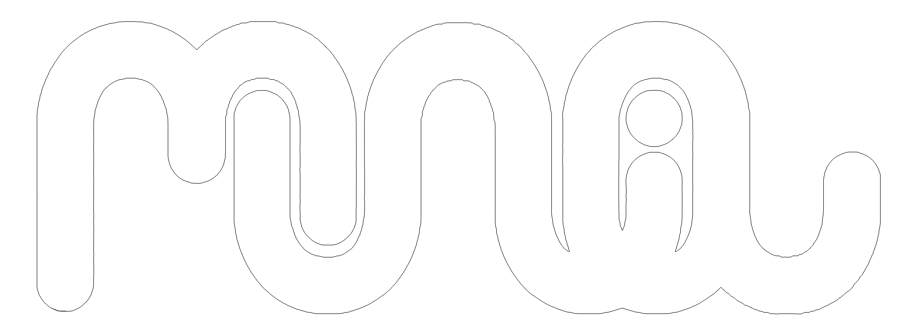

---
output:
  xaringan::moon_reader:
    lib_dir: libs
    css: xaringan-themer.css
    nature:
      highlightStyle: github
      highlightLines: true
      countIncrementalSlides: false
    seal: false
---
class: left, middle, inverse, hide-logo

```{r setup, include=FALSE}
knitr::opts_chunk$set(echo = FALSE)
```

```{r xaringan-themer, include=FALSE, warning=FALSE}
# Here the slides theme (TUM blue) is set and the fonts 
# feel free to change them
library(xaringanthemer)
style_mono_accent(
  base_color = "#00883A",
  header_font_google = google_font("Josefin Sans"),
  text_font_google   = google_font("Montserrat", "300", "300i"),
  code_font_google   = google_font("Fira Mono")
)
```

## Introduction to the Labs

### Deep Learning (SS25)

<center>
<br><br><br>
<br>
Emanuel Sommer
<br>
MUNIQ.AI lab @ Department of Statistics
<br>
Ludwig-Maximilians-Universität München
<br><br>
&nbsp;&nbsp;&nbsp;&nbsp;&nbsp;&nbsp;

</center>

---

## Labs

 - Mix of theoretical and practical exercises
 - Not graded! Only the final exam counts
 - Exercises and solutions for the previous week posted on Moodle on Thursdays
 - We will discuss the solutions of the previous week. I expect you to **come prepared**!
 - Lab sessions exist to discuss and ask questions
    - Attend not to fall behind the schedule

---

## Theory-oriented Exercises

 - Apply the math you see in the lectures
    - Pen-and-paper exercises on simple cases
    - Code the solution and test on simple problems
    - Brush up your linear algebra!
 - Purpose:
   1. Understand and internalize how things work
   2. Get practical experience in implementing ML algorithms
   3. Get ready for the exam

---

## Practice-oriented Exercises

 - Play with neural networks
 - Question and solutions are provided both in R & Python
   - I will present the solutions in either R or Python depending on the topic, but you are free to use and ask questions about the other version
   - I will indicate which version I will present on Moodle
 - Purpose:
   1. Learn to use a popular Deep Learning Framework
      - For R we will use Keras/Tensorflow
      - For Python we will use PyTorch
   2. Get a feeling for how neural networks behave

---
## Before we start
<br><br>

.center[

]