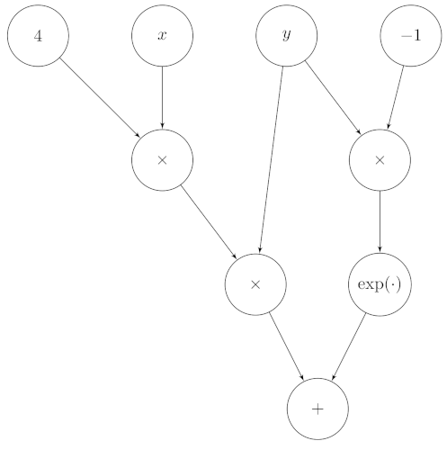

---
jupyter:
  jupytext:
    text_representation:
      extension: .md
      format_name: markdown
      format_version: '1.3'
      jupytext_version: 1.12.0
  kernelspec:
    display_name: Python 3
    language: python
    name: python3
---

<!-- #region pycharm={"name": "#%% md\n"} -->
# Lab 5

**Authors**: Emilio Dorigatti, Tobias Weber

Welcome to the fifth lab. We will first implement a simple scalar automatic
differentiation engine to compute partial derivatives for us,
then do a theoretical exercise about L2 regularization.

## Imports
<!-- #endregion -->

```python pycharm={"name": "#%%\n"}
from abc import ABC, abstractmethod
import math
from typing import Optional, List, Tuple, Union

import matplotlib.pyplot as plt
import torch
from matplotlib_inline.backend_inline import set_matplotlib_formats
from torch import Tensor

set_matplotlib_formats('png', 'pdf')
```

<!-- #region pycharm={"name": "#%% md\n"} -->
## Exercise 1

Modern deep learning frameworks compute gradients automatically,
so that you only need to define how to perform the forward pass in your code.
Under the hood, the framework constructs a computational graph based on the operations
you used. For example, consider the node:

\begin{equation}
4xy+e^{-y}
\label{eq:ex}
\end{equation}

It can be translated into a graph that looks like this:



Where we have 'leaf' nodes at the top for variables and constants, and 'internal' nodes
for operations. To make things simpler, in this exercise we will only work with
scalar operations and scalar variables, but what we are going to create could, in
principle, be extended to work with vectors and matrices. Section 6 of chapter 5 of the
_Mathematics for Machine Learning_ book (https://mml-book.github.io/) is a good
supplementary read.

The naming of the classes responds to:

 - `Sum` for Addition $x+y$
 - `Sub'` for Subtraction $x-y$
 - `Mul` for Product $x\cdot y$
 - `Div` for Division $x / y$
 - `Exp` for Exponentiation $e^x$
 - `TanH` for Hyperbolic tangent $\tanh(x)$
 - `Log` for Logarithm $\log(x)$


We first define some utilities to easily create nodes.
An abstract class gives us a common interface across all the respective nodes that
we will derive from it. This doesn't make sense now, as the class is basically empty,
but we will extend the definition over the course of the exercise.
<!-- #endregion -->

```python pycharm={"name": "#%%\n"}
class BaseNode(ABC):
    pass


class Const(BaseNode):
    def __init__(self, value: Union[float, int]):
        self.value = value


class Var(BaseNode):
    def __init__(self, name: str):
        self.name = name


class BinaryOperation(BaseNode, ABC):
    def __init__(self, x: BaseNode, y: BaseNode):
        self.x = x
        self.y = y


class Sum(BinaryOperation):
    pass


class Sub(BinaryOperation):
    pass


class Mul(BinaryOperation):
    pass


class Div(BinaryOperation):
    pass


class Function(BaseNode, ABC):
    def __init__(self, x: BaseNode):
        self.x = x


class Exp(Function):
    pass


class Log(Function):
    pass


class TanH(Function):
    pass
```

```python pycharm={"name": "#%%\n"}
# We then define the graph from the equation before.
x = Var('x')
y = Var('y')

z = Sum(
    x=Mul(
        x=Mul(
            x=Const(4),
            y=x
        ),
        y=y,
    ),
    y=Exp(
        x=Mul(
            x=Const(-1),
            y=y
    ))
)

print(z)
print(z.x.x)
print(z.y)
```

<!-- #region pycharm={"name": "#%% md\n"} -->
This structure of nested lists contains the computational graph for the node above.
Now, we can write code to manipulate this expression as we please.
In the course of this exercise, we will see how:

 1. Print an expression,
 2. Compute its value, given the values of the variables involved,
 3. Differentiate it to automatically find partial derivatives with respect to any given variable,
 4. Transform it into simpler expressions that are cheaper to handle, and
 5. Write code to train a neural network without getting our hands dirty with derivatives ever again.


### Printing an expression
First, since it is quite hard to understand the node from the representation above,
let us extend the classes to convert a computational graph into a string representation
that is easier to understand. For example, the expression $x+2y$ should be converted to
<!-- #endregion -->

```python pycharm={"name": "#%%\n"}
['(', 'x', '+', '(', '2', '*', 'y', ')', ')']
```

<!-- #region pycharm={"name": "#%% md\n"} -->
Which can be printed easily using `join`, resulting in `( x + ( 2 * y ) )`.

Such a function should be _recursive_. This means that when simplifying a complicated
expression it will call itself on each constituting piece of that expression, and
"assemble" the results together.
Conceptually, the procedure is similar to the factorial operation,
which is recursively defined in terms of the factorial of a smaller number:

\begin{equation}
n!=\begin{cases}
1 & \text{if }n < 1 \\
n\cdot(n-1)! & \text{otherwise}
\end{cases}
\end{equation}

This definition can be converted into Python as:
<!-- #endregion -->

```python pycharm={"name": "#%%\n"}
def factorial(n: int) -> int:
    if n < 1:
        return 1
    else:
        return n * factorial(n - 1)

print(factorial(4))
```

<!-- #region pycharm={"name": "#%% md\n"} -->
In a similar way, we extend the classes with `__str__`, which is a Python utility to
obtain a custom string representation of an object. If we define it correctly, we
are able to traverse through the tree and print the expression.
<!-- #endregion -->

```python pycharm={"name": "#%%\n"}
#!TAG SKIPQUESTEXEC

class BaseNode(ABC):
    @abstractmethod
    def __str__(self) -> str:
        pass


class Const(BaseNode):
    def __init__(self, value: Union[float, int]):
        self.value = value

    def __str__(self) -> str:
        return str(self.value)


class Var(BaseNode):
    def __init__(self, name: str):
        self.name = name

    def __str__(self) -> str:
        return self.name


class BinaryOperation(BaseNode, ABC):
    def __init__(self, x: BaseNode, y: BaseNode):
        self.x = x
        self.y = y


class Sum(BinaryOperation):
    def __str__(self) -> str:
        #!TAG HWBEGIN
        #!MSG Formulate an expression to print the operation recursively.
        return '({} + {})'.format(self.x, self.y)
        #!TAG HWEND


class Sub(BinaryOperation):
    def __str__(self) -> str:
        #!TAG HWBEGIN
        #!MSG Formulate an expression to print the operation recursively.
        return '({} - {})'.format(self.x, self.y)
        #!TAG HWEND


class Mul(BinaryOperation):
    def __str__(self) -> str:
        #!TAG HWBEGIN
        #!MSG Formulate an expression to print the operation recursively.
        return '({} * {})'.format(self.x, self.y)
        #!TAG HWEND


class Div(BinaryOperation):
    def __str__(self) -> str:
        #!TAG HWBEGIN
        #!MSG Formulate an expression to print the operation recursively.
        return '({} / {})'.format(self.x, self.y)
        #!TAG HWEND


class Function(BaseNode, ABC):
    def __init__(self, x: BaseNode):
        self.x = x


class Exp(Function):
    def __str__(self) -> str:
        #!TAG HWBEGIN
        #!MSG Formulate an expression to print the operation recursively.
        return 'exp({})'.format(self.x)
        #!TAG HWEND


class Log(Function):
    def __str__(self) -> str:
        #!TAG HWBEGIN
        #!MSG Formulate an expression to print the operation recursively.
        return 'log({})'.format(self.x)
        #!TAG HWEND


class TanH(Function):
    def __str__(self) -> str:
        #!TAG HWBEGIN
        #!MSG Formulate an expression to print the operation recursively.
        return 'tanh({})'.format(self.x)
        #!TAG HWEND
```

```python pycharm={"name": "#%%\n"}
#!TAG SKIPQUESTEXEC
x = Var('x')
y = Var('y')

z = Sum(
    x=Mul(
        x=Mul(
            x=Const(4),
            y=x
        ),
        y=y,
    ),
    y=Exp(
        x=Mul(
            x=Const(-1),
            y=y
    ))
)

print(z)
```

<!-- #region pycharm={"name": "#%% md\n"} -->
This is much simpler to read!

### Computing the value of an expression
We can now extend the classes to compute the value of an expression given values for
the variables. The methods should be recursive too.
<!-- #endregion -->

```python pycharm={"name": "#%%\n"}
#!TAG SKIPQUESTEXEC

class BaseNode(ABC):
    @abstractmethod
    def __str__(self) -> str:
        pass

    @abstractmethod
    def eval(self) -> Union[float, int]:
        pass


class Const(BaseNode):
    def __init__(self, value: Union[float, int]):
        self.value = value

    def __str__(self) -> str:
        return str(self.value)

    def eval(self) -> Union[float, int]:
        return self.value


class Var(BaseNode):
    def __init__(self, name: str, value: Optional[Union[float, int]] = None):
        self.name = name
        self.value = value
        
    def set_value(self, value: Union[float, int]) -> None:
        self.value = value

    def __str__(self) -> str:
        return self.name
    
    def eval(self) -> Union[float, int]:
        if self.value is None:
            raise ValueError('Value is not set. Evaluation is not possible.')
        return self.value


class BinaryOperation(BaseNode, ABC):
    def __init__(self, x: BaseNode, y: BaseNode):
        self.x = x
        self.y = y


class Sum(BinaryOperation):
    def __str__(self) -> str:
        return '({} + {})'.format(self.x, self.y)
    
    def eval(self) -> Union[float, int]:
        #!TAG HWBEGIN
        #!MSG Formulate an expression to compute the operation recursively.
        return self.x.eval() + self.y.eval()
        #!TAG HWEND


class Sub(BinaryOperation):
    def __str__(self) -> str:
        return '({} - {})'.format(self.x, self.y)

    def eval(self) -> Union[float, int]:
        #!TAG HWBEGIN
        #!MSG Formulate an expression to compute the operation recursively.
        return self.x.eval() - self.y.eval()
        #!TAG HWEND


class Mul(BinaryOperation):
    def __str__(self) -> str:
        return '({} * {})'.format(self.x, self.y)

    def eval(self) -> Union[float, int]:
        #!TAG HWBEGIN
        #!MSG Formulate an expression to compute the operation recursively.
        return self.x.eval() * self.y.eval()
        #!TAG HWEND


class Div(BinaryOperation):
    def __str__(self) -> str:
        return '({} / {})'.format(self.x, self.y)

    def eval(self) -> Union[float, int]:
        #!TAG HWBEGIN
        #!MSG Formulate an expression to compute the operation recursively.
        return self.x.eval() / self.y.eval()
        #!TAG HWEND


class Function(BaseNode, ABC):
    def __init__(self, x: BaseNode):
        self.x = x


class Exp(Function):
    def __str__(self) -> str:
        return 'exp({})'.format(self.x)

    def eval(self) -> Union[float, int]:
        #!TAG HWBEGIN
        #!MSG Formulate an expression to compute the operation recursively.
        return math.exp(self.x.eval())
        #!TAG HWEND

class Log(Function):
    def __str__(self) -> str:
        return 'log({})'.format(self.x)

    def eval(self) -> Union[float, int]:
        #!TAG HWBEGIN
        #!MSG Formulate an expression to compute the operation recursively.
        return math.log(self.x.eval())
        #!TAG HWEND

class TanH(Function):
    def __str__(self) -> str:
        return 'tanh({})'.format(self.x)

    def eval(self) -> Union[float, int]:
        #!TAG HWBEGIN
        #!MSG Formulate an expression to compute the operation recursively.
        return math.tanh(self.x.eval())
        #!TAG HWEND
```

```python pycharm={"name": "#%%\n"}
#!TAG SKIPQUESTEXEC
x = Var('x', value=2)
y = Var('y', value=3)

z = Sum(
    x=Mul(
        x=Mul(
            x=Const(4),
            y=x
        ),
        y=y,
    ),
    y=Exp(
        x=Mul(
            x=Const(-1),
            y=y
    ))
)

print(z.eval())
```

<!-- #region pycharm={"name": "#%% md\n"} -->
The result that we expect is, of course:
<!-- #endregion -->

```python pycharm={"name": "#%%\n"}
print(4 * 2 * 3 + math.exp(-3))
```

<!-- #region pycharm={"name": "#%% md\n"} -->
### Differentiating an expression

We can finally see how to differentiate an expression with respect to a variable.
We do this again through a recursive function that differentiates each argument
and merges the result. Note that this function should return a new computational
graph that contains the operations necessary to compute the partial derivative
we are interested in.

Remember to use the chain rule where appropriate!
<!-- #endregion -->
