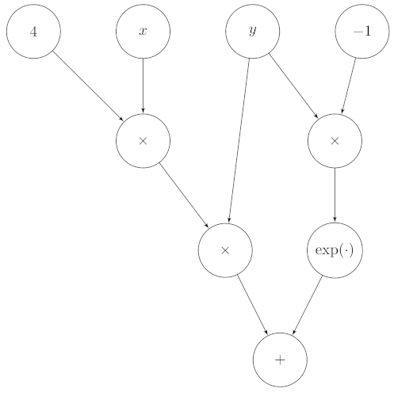

---
jupyter:
  jupytext:
    text_representation:
      extension: .md
      format_name: markdown
      format_version: '1.3'
      jupytext_version: 1.16.1
  kernelspec:
    display_name: Python 3
    language: python
    name: python3
---

<!-- #region pycharm={"name": "#%% md\n"} -->
# Lab 4

Welcome to the fourth lab. We will first implement a simple scalar automatic
differentiation engine to compute partial derivatives for us,
then do a theoretical exercise about L2 regularization.

## Imports

<!-- #endregion -->

```python pycharm={"name": "#%%\n"}
import math
from abc import ABC, abstractmethod
from random import uniform
from typing import Optional, List, Union, Dict

import matplotlib.pyplot as plt
from matplotlib_inline.backend_inline import set_matplotlib_formats

set_matplotlib_formats('png', 'pdf')
```

<!-- #region pycharm={"name": "#%% md\n"} -->
## Exercise 1

Modern deep learning frameworks compute gradients automatically,
so that you only need to define how to perform the forward pass in your code.
Under the hood, the framework constructs a computational graph based on the operations
you used. For example, consider the node:

$$
4xy+e^{-y}
$$

It can be translated into a graph that looks like this:



Where we have 'leaf' nodes at the top for variables and constants, and 'internal' nodes
for operations. To make things simpler, in this exercise we will only work with
scalar operations and scalar variables, but what we are going to create could, in
principle, be extended to work with vectors and matrices. Section 6 of chapter 5 of the
_Mathematics for Machine Learning_ book (https://mml-book.github.io/) is a good
supplementary read.

The naming of the classes responds to:

 - `Sum` for Addition $x+y$
 - `Sub` for Subtraction $x-y$
 - `Mul` for Product $x\cdot y$
 - `Div` for Division $x / y$
 - `Exp` for Exponentiation $e^x$
 - `TanH` for Hyperbolic tangent $\tanh(x)$
 - `Log` for Logarithm $\log(x)$


We first define some utilities to easily create nodes.
An abstract class gives us a common interface across all the respective nodes that
we will derive from it. This doesn't make sense now, as the class is basically empty,
but we will extend the definition over the course of the exercise.
<!-- #endregion -->

```python pycharm={"name": "#%%\n"}
class BaseNode(ABC):
    pass


class Const(BaseNode):
    def __init__(self, value: Union[float, int]):
        self.value = value


class Var(BaseNode):
    def __init__(self, name: str):
        self.name = name


class BinaryOperation(BaseNode, ABC):
    def __init__(self, x: BaseNode, y: BaseNode):
        self.x = x
        self.y = y


class Sum(BinaryOperation):
    pass


class Sub(BinaryOperation):
    pass


class Mul(BinaryOperation):
    pass


class Div(BinaryOperation):
    pass


class Function(BaseNode, ABC):
    def __init__(self, x: BaseNode):
        self.x = x


class Exp(Function):
    pass


class Log(Function):
    pass


class TanH(Function):
    pass
```

```python pycharm={"name": "#%%\n"}
# We then define the graph from the equation before.
x = Var('x')
y = Var('y')

z = Sum(
    x=Mul(
        x=Mul(
            x=Const(4),
            y=x
        ),
        y=y,
    ),
    y=Exp(
        x=Mul(
            x=Const(-1),
            y=y
    ))
)

print(z)
print(z.x.x)
print(z.y)
```

<!-- #region pycharm={"name": "#%% md\n"} -->
This structure of nested objects contains the computational graph for the node above.
Now, we can write code to manipulate this expression as we please.
In the course of this exercise, we will see how:

 1. Print an expression,
 2. Compute its value, given the values of the variables involved,
 3. Differentiate it to automatically find partial derivatives with respect to any given variable,
 4. Transform it into simpler expressions that are cheaper to handle, and
 5. Write code to train a neural network without getting our hands dirty with derivatives ever again.


### Printing an expression
First, since it is quite hard to understand the node from the representation above,
let us extend the classes to convert a computational graph into a string representation
that is easier to understand. For example, the expression $x+2y$ should be converted to
<!-- #endregion -->

```python pycharm={"name": "#%%\n"}
['(', 'x', '+', '(', '2', '*', 'y', ')', ')']
```

<!-- #region pycharm={"name": "#%% md\n"} -->
Which can be printed easily using `" ".join(<list>)`, resulting in `( x + ( 2 * y ) )`.

Such a function should be _recursive_. This means that when simplifying a complicated
expression it will call itself on each constituting piece of that expression, and
"assemble" the results together.
Conceptually, the procedure is similar to the factorial operation,
which is recursively defined in terms of the factorial of a smaller number:

\begin{equation}
n!=\begin{cases}
1 & \text{if }n < 1 \\
n\cdot(n-1)! & \text{otherwise}
\end{cases}
\end{equation}

This definition can be converted into Python as:
<!-- #endregion -->

```python pycharm={"name": "#%%\n"}
def factorial(n: int) -> int:
    if n < 1:
        return 1
    else:
        return n * factorial(n - 1)

print(factorial(4))
```

<!-- #region pycharm={"name": "#%% md\n"} -->
In a similar way, we extend the classes with `__str__`, which is a Python utility to
obtain a custom string representation of an object. If we define it correctly, we
are able to traverse through the tree and print the expression.
<!-- #endregion -->

```python pycharm={"name": "#%%\n"}
#!TAG SKIPQUESTEXEC

class BaseNode(ABC):
    @abstractmethod
    def __str__(self) -> str:
        pass


class Const(BaseNode):
    def __init__(self, value: Union[float, int]):
        self.value = value

    def __str__(self) -> str:
        return str(self.value)


class Var(BaseNode):
    def __init__(self, name: str):
        self.name = name

    def __str__(self) -> str:
        return self.name


class BinaryOperation(BaseNode, ABC):
    def __init__(self, x: BaseNode, y: BaseNode):
        self.x = x
        self.y = y


class Sum(BinaryOperation):
    def __str__(self) -> str:
        #!TAG HWBEGIN
        #!MSG Formulate an expression to print the operation recursively.
        return f'({self.x} + {self.y})'
        #!TAG HWEND


class Sub(BinaryOperation):
    def __str__(self) -> str:
        #!TAG HWBEGIN
        #!MSG Formulate an expression to print the operation recursively.
        return f'({self.x} - {self.y})'
        #!TAG HWEND


class Mul(BinaryOperation):
    def __str__(self) -> str:
        #!TAG HWBEGIN
        #!MSG Formulate an expression to print the operation recursively.
        return f'{self.x} * {self.y}'
        #!TAG HWEND


class Div(BinaryOperation):
    def __str__(self) -> str:
        #!TAG HWBEGIN
        #!MSG Formulate an expression to print the operation recursively.
        return f'{self.x} / {self.y}'
        #!TAG HWEND


class Function(BaseNode, ABC):
    def __init__(self, x: BaseNode):
        self.x = x


class Exp(Function):
    def __str__(self) -> str:
        #!TAG HWBEGIN
        #!MSG Formulate an expression to print the operation recursively.
        return f'exp({self.x})'
        #!TAG HWEND


class Log(Function):
    def __str__(self) -> str:
        #!TAG HWBEGIN
        #!MSG Formulate an expression to print the operation recursively.
        return f'log({self.x})'
        #!TAG HWEND


class TanH(Function):
    def __str__(self) -> str:
        #!TAG HWBEGIN
        #!MSG Formulate an expression to print the operation recursively.
        return f'tanh({self.x})'
        #!TAG HWEND
```

```python pycharm={"name": "#%%\n"}
#!TAG SKIPQUESTEXEC
x = Var('x')
y = Var('y')

z = Sum(
    x=Mul(
        x=Mul(
            x=Const(4),
            y=x
        ),
        y=y,
    ),
    y=Exp(
        x=Mul(
            x=Const(-1),
            y=y
    ))
)

print(z)
```

<!-- #region pycharm={"name": "#%% md\n"} -->
This is much simpler to read!

### Computing the value of an expression
We can now extend the classes to compute the value of an expression given values for
the variables. The methods should be recursive too.
<!-- #endregion -->

```python pycharm={"name": "#%%\n"}
#!TAG SKIPQUESTEXEC

class BaseNode(ABC):
    @abstractmethod
    def __str__(self) -> str:
        pass

    @abstractmethod
    def eval(self) -> Union[float, int]:
        pass


class Const(BaseNode):
    def __init__(self, value: Union[float, int]):
        self.value = value

    def __str__(self) -> str:
        return str(self.value)

    def eval(self) -> Union[float, int]:
        return self.value


class Var(BaseNode):
    def __init__(self, name: str, value: Optional[Union[float, int]] = None):
        self.name = name
        self.value = value
        
    def set_value(self, value: Union[float, int]) -> None:
        self.value = value

    def __str__(self) -> str:
        return self.name
    
    def eval(self) -> Union[float, int]:
        if self.value is None:
            raise ValueError('Value is not set. Evaluation is not possible.')
        return self.value


class BinaryOperation(BaseNode, ABC):
    def __init__(self, x: BaseNode, y: BaseNode):
        self.x = x
        self.y = y


class Sum(BinaryOperation):
    def __str__(self) -> str:
        return '({} + {})'.format(self.x, self.y)
    
    def eval(self) -> Union[float, int]:
        #!TAG HWBEGIN
        #!MSG Formulate an expression to compute the operation recursively.
        return self.x.eval() + self.y.eval()
        #!TAG HWEND


class Sub(BinaryOperation):
    def __str__(self) -> str:
        return '({} - {})'.format(self.x, self.y)

    def eval(self) -> Union[float, int]:
        #!TAG HWBEGIN
        #!MSG Formulate an expression to compute the operation recursively.
        return self.x.eval() - self.y.eval()
        #!TAG HWEND


class Mul(BinaryOperation):
    def __str__(self) -> str:
        return '({} * {})'.format(self.x, self.y)

    def eval(self) -> Union[float, int]:
        #!TAG HWBEGIN
        #!MSG Formulate an expression to compute the operation recursively.
        return self.x.eval() * self.y.eval()
        #!TAG HWEND


class Div(BinaryOperation):
    def __str__(self) -> str:
        return '({} / {})'.format(self.x, self.y)

    def eval(self) -> Union[float, int]:
        #!TAG HWBEGIN
        #!MSG Formulate an expression to compute the operation recursively.
        return self.x.eval() / self.y.eval()
        #!TAG HWEND


class Function(BaseNode, ABC):
    def __init__(self, x: BaseNode):
        self.x = x


class Exp(Function):
    def __str__(self) -> str:
        return 'exp({})'.format(self.x)

    def eval(self) -> Union[float, int]:
        #!TAG HWBEGIN
        #!MSG Formulate an expression to compute the operation recursively.
        return math.exp(self.x.eval())
        #!TAG HWEND

class Log(Function):
    def __str__(self) -> str:
        return 'log({})'.format(self.x)

    def eval(self) -> Union[float, int]:
        #!TAG HWBEGIN
        #!MSG Formulate an expression to compute the operation recursively.
        return math.log(self.x.eval())
        #!TAG HWEND

class TanH(Function):
    def __str__(self) -> str:
        return 'tanh({})'.format(self.x)

    def eval(self) -> Union[float, int]:
        #!TAG HWBEGIN
        #!MSG Formulate an expression to compute the operation recursively.
        return math.tanh(self.x.eval())
        #!TAG HWEND
```

```python pycharm={"name": "#%%\n"}
#!TAG SKIPQUESTEXEC
x = Var('x', value=2)
y = Var('y', value=3)

z = Sum(
    x=Mul(
        x=Mul(
            x=Const(4),
            y=x
        ),
        y=y,
    ),
    y=Exp(
        x=Mul(
            x=Const(-1),
            y=y
    ))
)

print(round(z.eval(), 4))
```

<!-- #region pycharm={"name": "#%% md\n"} -->
The result that we expect is, of course:
<!-- #endregion -->

```python pycharm={"name": "#%%\n"}
print(round(4 * 2 * 3 + math.exp(-3), 4))
```

<!-- #region pycharm={"name": "#%% md\n"} -->
### Differentiating an expression

We can finally see how to differentiate an expression with respect to a variable.
We do this again through extending the classes to differentiates each argument
and merge the result. Note that this should return a new computational
graph that contains the operations necessary to compute the partial derivative
we are interested in.
Each `differentiate` method gets the argument `var` that specifies the name of the
variable of which we are computing the gradient.

Remember to use the chain rule where appropriate!
<!-- #endregion -->

```python pycharm={"name": "#%%\n"}
#!TAG SKIPQUESTEXEC

class BaseNode(ABC):
    @abstractmethod
    def __str__(self) -> str:
        pass

    @abstractmethod
    def eval(self) -> Union[float, int]:
        pass

    @abstractmethod
    def differentiate(self, var: str) -> BaseNode:
        pass


class Const(BaseNode):
    def __init__(self, value: Union[float, int]):
        self.value = value

    def __str__(self) -> str:
        return str(self.value)

    def eval(self) -> Union[float, int]:
        return self.value

    def differentiate(self, var: str) -> BaseNode:
        return Const(0)


class Var(BaseNode):
    def __init__(self, name: str, value: Optional[Union[float, int]] = None):
        self.name = name
        self.value = value

    def set_value(self, value: Union[float, int]) -> None:
        self.value = value

    def __str__(self) -> str:
        return self.name

    def eval(self) -> Union[float, int]:
        if self.value is None:
            raise ValueError('Value is not set. Evaluation is not possible.')
        return self.value

    def differentiate(self, var: str) -> BaseNode:
        return Const(1) if self.name == var else Const(0)


class BinaryOperation(BaseNode, ABC):
    def __init__(self, x: BaseNode, y: BaseNode):
        self.x = x
        self.y = y


class Sum(BinaryOperation):
    def __str__(self) -> str:
        return '({} + {})'.format(self.x, self.y)

    def eval(self) -> Union[float, int]:
        return self.x.eval() + self.y.eval()

    def differentiate(self, var: str) -> BaseNode:
        #!TAG HWBEGIN
        #!MSG TODO Return a new node that sums the derivatives of the left and right part.
        #!MSG Note: We are returning a new graph node that connects the two
        #!MSG graphs representing the derivatives of the left and right parts
        return Sum(self.x.differentiate(var), self.y.differentiate(var))
        #!TAG HWEND


class Sub(BinaryOperation):
    def __str__(self) -> str:
        return '({} - {})'.format(self.x, self.y)

    def eval(self) -> Union[float, int]:
        return self.x.eval() - self.y.eval()

    def differentiate(self, var: str) -> BaseNode:
        #!TAG HWBEGIN
        #!MSG TODO Return a new node that subtracts the derivatives of the left and right part.
        return Sub(self.x.differentiate(var), self.y.differentiate(var))
        #!TAG HWEND


class Mul(BinaryOperation):
    def __str__(self) -> str:
        return '({} * {})'.format(self.x, self.y)

    def eval(self) -> Union[float, int]:
        return self.x.eval() * self.y.eval()

    def differentiate(self, var: str) -> BaseNode:
        #!TAG HWBEGIN
        #!MSG TODO differentiate the product x * y. (Hint: Product rule)
        return Sum(
            x=Mul(self.x.differentiate(var), self.y),
            y=Mul(self.x, self.y.differentiate(var))
        )
        #!TAG HWEND


class Div(BinaryOperation):
    def __str__(self) -> str:
        return '({} / {})'.format(self.x, self.y)

    def eval(self) -> Union[float, int]:
        return self.x.eval() / self.y.eval()

    def differentiate(self, var: str) -> BaseNode:
        #!TAG HWBEGIN
        #!MSG TODO differentiate the quotient x / y. (Hint: Quotient rule)
        return Div(
            x=Sub(
                x=Mul(self.x.differentiate(var), self.y),
                y=Mul(self.y.differentiate(var), self.x)
            ),
            y=Mul(self.y, self.y)
        )
        #!TAG HWEND


class Function(BaseNode, ABC):
    def __init__(self, x: BaseNode):
        self.x = x


class Exp(Function):
    def __str__(self) -> str:
        return 'exp({})'.format(self.x)

    def eval(self) -> Union[float, int]:
        return math.exp(self.x.eval())

    def differentiate(self, var: str) -> BaseNode:
        #!TAG HWBEGIN
        #!MSG TODO differentiate exp(x). (Hint: Chain rule)
        return Mul(
            x=Exp(self.x),
            y=self.x.differentiate(var)
        )
        #!TAG HWEND


class Log(Function):
    def __str__(self) -> str:
        return 'log({})'.format(self.x)

    def eval(self) -> Union[float, int]:
        return math.log(self.x.eval())

    def differentiate(self, var: str) -> BaseNode:
        #!TAG HWBEGIN
        #!MSG TODO differentiate log(x). (Hint: Chain rule)
        return Div(
            x=self.x.differentiate(var),
            y=self.x
        )
        #!TAG HWEND


class TanH(Function):
    def __str__(self) -> str:
        return 'tanh({})'.format(self.x)

    def eval(self) -> Union[float, int]:
        return math.tanh(self.x.eval())

    def differentiate(self, var: str) -> BaseNode:
        #!TAG HWBEGIN
        #!MSG TODO differentiate tanh(x). (Hint: Chain rule)
        return Mul(
            x=Sub(
                x=Const(1),
                y=Mul(TanH(self.x), TanH(self.x))
            ),
            y=self.x.differentiate(var)
        )
        #!TAG HWEND
```

```python pycharm={"name": "#%%\n"}
#!TAG SKIPQUESTEXEC
x = Var('x', value=2)
y = Var('y', value=3)

z = Sum(
    x=Mul(
        x=Mul(
            x=Const(4),
            y=x
        ),
        y=y,
    ),
    y=Exp(
        x=Mul(
            x=Const(-1),
            y=y
    ))
)

dz = z.differentiate('x')
print(dz)
```

<!-- #region pycharm={"name": "#%% md\n"} -->
This looks a bit complicated, but by applying some trivial simplifications we see it is correct:

\begin{align*}
& ( ( ( ( ( 0 \cdot x ) + ( 4 \cdot 1 ) ) \cdot y ) + ( ( 4 \cdot x ) \cdot 0 ) ) + ( exp ( ( -1 \cdot y ) ) \cdot ( ( 0 \cdot y ) + ( -1 \cdot 0 ) ) ) )  \\
&\qquad= ( ( ( 0 + 4 ) \cdot y ) + 0 ) + ( exp ( ( -1 \cdot y ) ) \cdot ( 0 + 0 ) ) ) \\
&\qquad= ( 4 \cdot y ) + ( exp ( ( -1 \cdot y ) ) \cdot 0 ) ) \\
&\qquad= ( 4 \cdot y ) + 0 \\
&\qquad= 4 \cdot y \\
&\qquad= \frac{\text{d}}{\text{d}x} \left(4xy+e^{-y}\right)
\end{align*}

These simplification rules are trivial arithmetic identities:

 - $0+x=x$
 - $0\cdot x=0$
 - $1\cdot x=x$
 - $0/x=0$

Let us extend the classes that use these identities to automatically simplify `dz` in
the same way we just did. As with differentiation, this should return a
new computational graph.
<!-- #endregion -->

```python pycharm={"name": "#%%\n"}
#!TAG SKIPQUESTEXEC

class BaseNode(ABC):
    @abstractmethod
    def __str__(self) -> str:
        pass

    @abstractmethod
    def eval(self) -> Union[float, int]:
        pass

    @abstractmethod
    def differentiate(self, var: str) -> BaseNode:
        pass

    @abstractmethod
    def simplify(self):
        pass


class Const(BaseNode):
    def __init__(self, value: Union[float, int]):
        self.value = value

    def __str__(self) -> str:
        return str(self.value)

    def eval(self) -> Union[float, int]:
        return self.value

    def differentiate(self, var: str) -> BaseNode:
        return Const(0)

    def simplify(self):
        return self


class Var(BaseNode):
    def __init__(self, name: str, value: Optional[Union[float, int]] = None):
        self.name = name
        self.value = value

    def set_value(self, value: Union[float, int]) -> None:
        self.value = value

    def __str__(self) -> str:
        return self.name

    def eval(self) -> Union[float, int]:
        if self.value is None:
            raise ValueError('Value is not set. Evaluation is not possible.')
        return self.value

    def differentiate(self, var: str) -> BaseNode:
        return Const(1) if self.name == var else Const(0)

    def simplify(self):
        return self


class BinaryOperation(BaseNode, ABC):
    def __init__(self, x: BaseNode, y: BaseNode):
        self.x = x
        self.y = y


class Sum(BinaryOperation):
    def __str__(self) -> str:
        return '({} + {})'.format(self.x, self.y)

    def eval(self) -> Union[float, int]:
        return self.x.eval() + self.y.eval()

    def differentiate(self, var: str) -> BaseNode:
        return Sum(self.x.differentiate(var), self.y.differentiate(var))

    def simplify(self):
        simple_x = (
            #!TAG HWBEGIN
            #!MSG Simplify the left part.
            self.x.simplify()
            #!TAG HWEND
        )

        simple_y = (
            #!TAG HWBEGIN
            #!MSG Simplify the right part.
            self.y.simplify()
            #!TAG HWEND
        )

        if isinstance(simple_x, Const):
            if simple_x.value == 0:
                # Rule: 0 + y = y
                return simple_y

        if isinstance(simple_y, Const):
            if simple_y.value == 0:
                # Rule: x + 0 = x
                return simple_x

        if isinstance(simple_x, Const) and isinstance(simple_y, Const):
            # If both arguments are constants we can perform the sum immediately
            return Const(simple_x.value + simple_y.value)

        # Cannot simplify further. Return a new sum node with the simplified operands.
        return Sum(simple_x, simple_y)


class Sub(BinaryOperation):
    def __str__(self) -> str:
        return '({} - {})'.format(self.x, self.y)

    def eval(self) -> Union[float, int]:
        return self.x.eval() - self.y.eval()

    def differentiate(self, var: str) -> BaseNode:
        return Sub(self.x.differentiate(var), self.y.differentiate(var))

    def simplify(self):
        #!TAG HWBEGIN
        #!MSG TODO simplify x - y
        simple_x =  self.x.simplify()
        simple_y =  self.y.simplify()

        if isinstance(simple_x, Const):
            if simple_x.value == 0:
                # Rule: 0 - y = -1 * y
                return Mul(Const(-1), simple_y)

        if isinstance(simple_y, Const):
            if simple_y.value == 0:
                # Rule: x - 0 = x
                return simple_y

        if isinstance(simple_x, Const) and isinstance(simple_y, Const):
            # If both arguments are constants we can perform the subtraction immediately
            return Const(simple_x.value - simple_y.value)

        # Cannot simplify further.
        return Sub(simple_x, simple_y)
        #!TAG HWEND


class Mul(BinaryOperation):
    def __str__(self) -> str:
        return '({} * {})'.format(self.x, self.y)

    def eval(self) -> Union[float, int]:
        return self.x.eval() * self.y.eval()

    def differentiate(self, var: str) -> BaseNode:
        return Sum(
            x=Mul(self.x.differentiate(var), self.y),
            y=Mul(self.x, self.y.differentiate(var))
        )

    def simplify(self):
        #!TAG HWBEGIN
        #!MSG TODO simplify x * y
        simple_x =  self.x.simplify()
        simple_y =  self.y.simplify()

        if isinstance(simple_x, Const):
            if simple_x.value == 0:
                # Rule: 0 * y = 0
                return Const(0)
            elif simple_x.value == 1:
                # Rule: 1 * y = y
                return simple_y

        if isinstance(simple_y, Const):
            if simple_y.value == 0:
                # Rule: x * 0 = 0
                return Const(0)
            elif simple_y.value == 1:
                # Rule: x * 1 = x
                return simple_x

        if isinstance(simple_x, Const) and isinstance(simple_y, Const):
            # Perform the operation if possible
            return Const(simple_x.value * simple_y.value)

        # Cannot simplify further.
        return Mul(simple_x, simple_y)
        #!TAG HWEND


class Div(BinaryOperation):
    def __str__(self) -> str:
        return '({} / {})'.format(self.x, self.y)

    def eval(self) -> Union[float, int]:
        return self.x.eval() / self.y.eval()

    def differentiate(self, var: str) -> BaseNode:
        return Div(
            x=Sub(
                x=Mul(self.x.differentiate(var), self.y),
                y=Mul(self.y.differentiate(var), self.x)
            ),
            y=Mul(self.y, self.y)
        )

    def simplify(self):
        #!TAG HWBEGIN
        #!MSG TODO simplify x / y
        simple_x =  self.x.simplify()
        simple_y =  self.y.simplify()

        if isinstance(simple_x, Const):
            if simple_x.value == 0:
                # Rule: 0 / y = 0
                return Const(0)

        if isinstance(simple_y, Const):
            if simple_y.value == 0:
                # Rule: x / 0 = ERROR
                raise ZeroDivisionError()
            elif simple_y.value == 1:
                # Rule: x / 1 = x
                return simple_x

        if isinstance(simple_x, Const) and isinstance(simple_y, Const):
            # Perform the operation if possible
            return Const(simple_x.value / simple_y.value)

        # Cannot simplify further.
        return Div(simple_x, simple_y)
        #!TAG HWEND


class Function(BaseNode, ABC):
    def __init__(self, x: BaseNode):
        self.x = x


class Exp(Function):
    def __str__(self) -> str:
        return 'exp({})'.format(self.x)

    def eval(self) -> Union[float, int]:
        return math.exp(self.x.eval())

    def differentiate(self, var: str) -> BaseNode:
        return Mul(
            x=Exp(self.x),
            y=self.x.differentiate(var)
        )

    def simplify(self):
        #!TAG HWBEGIN
        #!MSG TODO simplify exp(x)
        simple_x =  self.x.simplify()

        if isinstance(simple_x, Const):
            if simple_x.value == 0:
                # Rule: exp(0) = 1
                return Const(1)
            # Perform the operation if possible
            return Const(math.exp(simple_x.value))

        # Cannot simplify further.
        return Exp(simple_x)
        #!TAG HWEND


class Log(Function):
    def __str__(self) -> str:
        return 'log({})'.format(self.x)

    def eval(self) -> Union[float, int]:
        return math.log(self.x.eval())

    def differentiate(self, var: str) -> BaseNode:
        return Div(
            x=self.x.differentiate(var),
            y=self.x
        )

    def simplify(self):
        #!TAG HWBEGIN
        #!MSG TODO simplify log(x)
        simple_x =  self.x.simplify()

        if isinstance(simple_x, Const):
            if simple_x.value <= 0:
                # Rule: No log of non-positiv number!
                raise ValueError('Logarithm of non-positiv number.')
            # Perform the operation if possible
            return Const(math.log(simple_x.value))

        # Cannot simplify further.
        return Log(simple_x)
        #!TAG HWEND


class TanH(Function):
    def __str__(self) -> str:
        return 'tanh({})'.format(self.x)

    def eval(self) -> Union[float, int]:
        return math.tanh(self.x.eval())

    def differentiate(self, var: str) -> BaseNode:
        return Mul(
            x=Sub(
                x=Const(1),
                y=Mul(TanH(self.x), TanH(self.x))
            ),
            y=self.x.differentiate(var)
        )

    def simplify(self):
        #!TAG HWBEGIN
        #!MSG TODO simplify log(x)
        simple_x =  self.x.simplify()

        if isinstance(simple_x, Const):
            if simple_x.value == 0:
                # Rule: tanh(0) = 0
                return Const(0)
            # Perform the operation if possible
            return Const(math.tanh(simple_x.value))

        # Cannot simplify further.
        return TanH(simple_x)
        #!TAG HWEND
```

```python pycharm={"name": "#%%\n"}
#!TAG SKIPQUESTEXEC
x = Var('x', value=2)
y = Var('y', value=3)

z = Sum(
    x=Mul(
        x=Mul(
            x=Const(4),
            y=x
        ),
        y=y,
    ),
    y=Exp(
        x=Mul(
            x=Const(-1),
            y=y
    ))
)

dz = z.differentiate('x')
print(dz.simplify())
```

<!-- #region pycharm={"name": "#%% md\n"} -->
The result matches what we showed above, $4y$. Simplifying the graph with these and
other, more advanced tricks, can greatly speed up code.

Now we are also equipped to perform differentiation of any order,
for example $\partial z / \partial x\partial y$ is simply:
<!-- #endregion -->

```python pycharm={"name": "#%%\n"}
#!TAG SKIPQUESTEXEC

print(z.differentiate('x').differentiate('y'))
print(z.differentiate('x').differentiate('y').simplify())
print(z.differentiate('x').differentiate('y').eval())
```

<!-- #region pycharm={"name": "#%% md\n"} -->
### Training a network

Let us now define a computational graph that performs the forward pass of a
simple network, and use the functions above to compute the gradients of the parameters.
We will use the same network we used in the third lab, reproduced below, and, as usual,
we will test the code on the five points dataset. Since the functions we have written
so far only work with scalar values, we will perform stochastic gradient descent
using one sample at a time.


<!-- #endregion -->

```python pycharm={"name": "#%%\n"}
#!TAG SKIPQUESTEXEC

# The two input nodes
x1 = Var('x1')
x2 = Var('x2')

# Parameters for the first hidden neuron
b1 = Var('b1')
w11 = Var('w11')
w21 = Var('w21')

# Compute the output of the first hidden neuron
z1in = Sum(
    x=b1,
    y=Sum(
       x=Mul(x1, w11),
       y=Mul(x2, w21)
    )
)

z1out = TanH(z1in)

print(z1out)
```

<!-- #region pycharm={"name": "#%% md\n"} -->
Now, complete the remaining part of the network:
<!-- #endregion -->

```python pycharm={"name": "#%%\n"}
#!TAG SKIPQUESTEXEC

#!TAG HWBEGIN
#!MSG TODO define the parameters of the second hidden neuron.
b2 = Var('b2')
w12 = Var('w12')
w22 = Var('w22')
#!TAG HWEND

z2out = (
    #!TAG HWBEGIN
    #!MSG TODO compute the output of the second hidden neuron
    TanH(
        Sum(
            x=b2,
            y=Sum(
                x=Mul(x1, w12),
                y=Mul(x2, w22)
            )
        )
    )
    #!TAG HWEND
)

#!TAG HWBEGIN
#!MSG TODO define the parameters of the output neuron
c = Var('c')
u1 = Var('u1')
u2 = Var('u2')
#!TAG HWEND

fin = (
    #!TAG HWBEGIN
    #!MSG TODO compute the input to the sigmoid (called logits)
    Sum(
        x=c,
        y=Sum(
            x=Mul(z1out, u1),
            y=Mul(z2out, u2)
        )
    )
  #!TAG HWEND
)

fout = (
    #!TAG HWBEGIN
    #!MSG TODO compute the output of the network: sigmoid(fin)
    Div(
        x=Const(1),
        y=Sum(
            x=Const(1),
            y=Exp(Mul(Const(-1), fin))
        )
    )
    #!TAG HWEND
)

print(fout)
```

<!-- #region pycharm={"name": "#%% md\n"} -->
And this defines the forward pass.

We can now compute the predictions of the network by evaluating `fout`,
providing values for the inputs and weights. For example:
<!-- #endregion -->

```python pycharm={"name": "#%%\n"}
#!TAG SKIPQUESTEXEC

# Values for weights and biases
b1.set_value(1.543385)
w11.set_value(3.111573)
w12.set_value(-2.808800)

b2.set_value(1.373085)
w21.set_value(3.130452)
w22.set_value(-2.813466)

c.set_value(-4.241453)
u1.set_value(4.036489)
u2.set_value(4.074885)

# Values for the input
x1.set_value(1)
x2.set_value(-1)

fout.eval()
```

<!-- #region pycharm={"name": "#%% md\n"} -->
Which should be about 0.9.
We now have to compute the cross-entropy loss.
For numerical stability, we will compute the loss using $f_{in}$ instead of $f_{out}$.
Therefore, first, show that:

\begin{equation}
-y\cdot\log(f_{out})-(1-y)\cdot\log(1-f_{out})=
f_{in}-f_{in}\cdot y+\log(1+e^{-f_{in}})
\end{equation}

#!TAG HWBEGIN

Solution:

\begin{align}
&-y\cdot\log (f_{out})-(1-y)\cdot\log(1-f_{out}) \\
&\qquad=-y\cdot\log\frac{1}{1+e^{-f_{in}}}-(1-y)\cdot\log\left(1-\frac{1}{1+e^{-f_{in}}}\right) \\
&\qquad=
-y\cdot-\log\left(1+e^{-f_{in}}\right)
-(1-y)\cdot\left(-f_{in}-\log\left(1+e^{-f_{in}}\right)\right) \\
&\qquad=
y\cdot\log\left(1+e^{-f_{in}}\right)
+f_{in}+\log\left(1+e^{-f_{in}}\right)
-y\cdot f_{in}-y\cdot\log\left(1+e^{-f_{in}}\right) \\
&\qquad=f_{in}-f_{in}\cdot y+\log(1+e^{-f_{in}})
\end{align}
#!TAG HWEND
<!-- #endregion -->

```python pycharm={"name": "#%%\n"}
#!TAG SKIPQUESTEXEC

# This variable contains the label for the sample the network is predicting
y = Var('y')

loss = (
    #!TAG HWBEGIN
    #!MSG TODO compute the binary cross entropy loss with the logits (Eq. 3, right)
    Sum(
        x=Sub(
            x=fin,
            y=Mul(fin, y)
        ),
        y=Log(
            Sum(
                x=Const(1),
                y=Exp(Mul(Const(-1), fin)))
        )
    )
    #!TAG HWEND
)

print(loss)
```

<!-- #region pycharm={"name": "#%% md\n"} -->
This is starting to look complicated!
Luckily, this time, we do not have to get our hands dirty with derivatives.
Let us find the graphs for the derivatives of each parameter of the network.
<!-- #endregion -->

```python pycharm={"name": "#%%\n"}
#!TAG SKIPQUESTEXEC

def get_gradient_graphs(graph: BaseNode, param_nodes: List[Var]) -> Dict:
    graph_dict: Dict = {}
    for param_node in param_nodes:
        graph_dict.update({
            param_node.name : graph.differentiate(param_node.name)
        })
    return graph_dict

parameter_nodes = [b1, w11, w12, b2, w21, w22, c, u1, u2]
gradient_graphs = get_gradient_graphs(loss, parameter_nodes)
print(gradient_graphs.get('w11'))
```

<!-- #region pycharm={"name": "#%% md\n"} -->
As you can see, there is a great deal of repetition in this expression.
The repetitions could be removed by storing, in each node, its current value and
gradient, so that we would not need to re-compute them every time. Modern deep
learning frameworks indeed do this, and are able to compute the gradient of the
loss with respect to all parameters in a single pass, but here we accept these
inefficiencies for the sake of simplicity.

We are now ready to train this network:
<!-- #endregion -->

```python pycharm={"name": "#%%\n"}
#!TAG SKIPQUESTEXEC

# Create dataset.
x = [
    [0, 0],
    [1, 0],
    [0, -1],
    [-1, 0],
    [0, 1]
]
labels = [1, 0, 0, 0, 0]

# Glorot initialization for the parameters.
def init_params(param_nodes: List[Var], bias_names: List[str]) -> None:
    b = math.sqrt(6 / 4)
    for param_node in param_nodes:
        if param_node.name in bias_names:
            param_node.set_value(0.0)
        else:
            param_node.set_value(uniform(-b, b))

init_params(parameter_nodes, ['b1', 'b2', 'c'])

# Training Loop.
# Losses dict follows (index of sample : list of losses during training).
loss_dict = {i: [] for i in range(len(x))}
for ep in range(250):
    ep_loss = 0.
    for i in range(len(x)):
        # Set the correct values for the inputs and label.
        x1.set_value(x[i][0])
        x2.set_value(x[i][1])
        y.set_value(labels[i])

        loss_dict[i].append(
            #!TAG HWBEGIN
            #!MSG TODO compute the loss for sample i.
            loss.eval()
            #!TAG HWEND
        )
        ep_loss += loss_dict[i][-1]

        #!TAG HWBEGIN
        #!MSG TODO Compute and evaluate gradient graphs.
        #!MSG TODO Perform one step of gradient descent.
        #!MSG Hint: Use the `get_gradient_graphs` function we defined above.
        #!MSG Hint: When having convergence issues, it might help to start with a large
        #!MSG learning rate (e.g. 2.5) and reduce it in the higher epochs.
        gradient_graphs = get_gradient_graphs(loss, parameter_nodes)
        gradients_eval = {key: graph.simplify().eval() for key, graph in gradient_graphs.items()}

        for parameter_node in parameter_nodes:
            lr = 2.5 if ep < 100 else 0.5
            new_val = parameter_node.value - lr * gradients_eval[parameter_node.name]
            parameter_node.set_value(new_val)
        #!TAG HWEND

    print('EPOCH: \t {:5} \t LOSS: \t {:.5f}'.format(ep + 1, float(ep_loss)), end='\r')


# Plot loss development.
for sample_loss in loss_dict.values():
    plt.plot(sample_loss)
plt.show()
```

<!-- #region pycharm={"name": "#%% md\n"} -->
You can clearly see how the loss of each individual training sample evolves over time.
This also explains the "saddle" you might have noticed in the loss curve from the
previous lab.

And these are the predictions for the five points:
<!-- #endregion -->

```python pycharm={"name": "#%%\n"}
#!TAG SKIPQUESTEXEC

for i in range(len(x)):
    x1.set_value(x[i][0])
    x2.set_value(x[i][1])
    y.set_value(labels[i])

    prediction = fout.eval()
    print('SAMPLE:\t{}\tTRUE:\t{}\tPRED:\t{:.3f}'.format(i, labels[i], prediction))
```

<!-- #region pycharm={"name": "#%% md\n"} -->
### Conclusion
What we did in this exercise is (a simplification of) how deep learning frameworks
evaluate the code you write. You only need to define how to compute the output of
the network, and the framework figures out the necessary gradients on its own.
They provide a much better user interface, allowing you to use `+`, `-`, `/`, `*` etc.
as you normally would instead of the clumsy node constructors we defined here,
but there is always a computational graph hidden behind the curtains.


## Exercise 2

This exercise should improve your understanding of weight decay (or L2 regularization).

  1. Consider a quadratic error function $E(\textbf{w})=E_0+\textbf{b}^T\textbf{w}+1/2\cdot\textbf{w}^T\textbf{H}\textbf{w}$ and its regularized counterpart $E'(\textbf{w})=E(\textbf{w})+\tau/2 \cdot\textbf{w}^T\textbf{w}$, and let $\textbf{w}^*$ and $\tilde{\textbf{w}}$ be the minimizers of $E$ and $E'$ respectively. We want to find a node to express $\tilde{\textbf{w}}$ as a function of $\textbf{w}^*$, i.e. find the displacement introduced by weight decay.

      - Find the gradients of $E$ and $E'$. Note that, at the global minimum,
     we have $\nabla E(\textbf{w}^*)=\nabla E'(\tilde{\textbf{w}})=0$.
      - In the equality above, express $\textbf{w}^*$ and $\tilde{\textbf{w}}$ as a
     linear combination of the eigenvectors of $\textbf{H}$.
      - Through algebraic manipulation, obtain $\tilde{\textbf{w}}_i$ as a function
     of $\textbf{w}^*_i$.
      - Interpret this result geometrically.
      - Note: $\textbf{H}$ is square, symmetric, and positive definite,
     which means that its eigenvectors are pairwise orthogonal and its eigenvalues
     are positive (spectral theorem).

  2. Consider a linear network of the form $y=\textbf{w}^T\textbf{x}$ and the mean
squared error as a loss function. Assume that every observation is corrupted
with Gaussian noise $\epsilon\sim\mathcal{N}(\textbf{0}, \sigma^2\textbf{I})$.
Compute the expectation of the gradient under $\epsilon$ and,
show that adding gaussian noise to the inputs has the same effect of weight decay.

#!TAG HWBEGIN

### Solution

#### Question 1

The error is computed as:

\begin{equation}
    E(\textbf{w})=E_0+\sum_i w_ib_i+\frac 1 2 \sum_i\sum_j w_iw_jh_{ij}
\end{equation}

The derivative with respect to $w_i$ is, then:

\begin{equation}
    \frac{\partial E}{\partial w_i}=b_i+\sum_j w_jh_{ij}
\end{equation}

Where the factor $1/2$ was removed since the pair $w_i$ and $w_j$ is multiplied
together twice, and $h_{ij}=h_{ji}$. In vector form:

\begin{equation}
    \nabla_{\textbf{w}} E(\textbf{w})=\textbf{b}+\textbf{H}\textbf{w}
\end{equation}

The same reasoning applied to $E'$ yields:

\begin{equation}
\nabla_{\textbf{w}} E'(\textbf{w})=\textbf{b}+\textbf{H}\textbf{w}+\tau\textbf{w}
\end{equation}

Now let $\textbf{u}_i$ and $\lambda_i$ be the eigenvectors and eigenvalues of
$\textbf{H}$, so that $\textbf{H}\textbf{u}_i=\lambda_i\textbf{u}_i$.
 Any vector $\textbf{v}$ can then be expressed as
 $\textbf{v}=\sum_i\gamma_i\textbf{u}_i$. Now, note that

\begin{equation}
\textbf{H}\textbf{v}=\sum_i\gamma_i\textbf{H}\textbf{u}_i=\sum_i\gamma_i\lambda_i\textbf{u}_i
\end{equation}


Moreover, at the global minimum, both gradients equal zero, hence:

\begin{equation}
\textbf{b}+\underbrace{
  \sum_i\alpha_i\lambda_i\textbf{u}_i
}_{
  \textbf{H}\textbf{w}^*
}
=
\textbf{b}+\underbrace{
  \sum_i\beta_i\lambda_i\textbf{u}_i
}_{
  \textbf{H}\tilde{\textbf{w}}
}+\tau\underbrace{
  \sum_i\beta_i\textbf{u}_i
  }_{
    \tilde{\textbf{w}}
  }
\Longleftrightarrow
\sum_i\left( \alpha_i\lambda_i-\beta_i\lambda_i-\tau\beta_i \right)\textbf{u}_i=\textbf{0}
\end{equation}

Since the eigenvectors are linearly independent, the above expression is zero only
when each term inside the sum is zero, i.e.

\begin{equation}
\alpha_i\lambda_i-\beta_i\lambda_i-\tau\beta_i=0
\Longleftrightarrow \beta_i=\frac{\lambda_i}{\lambda_i+\tau}\alpha_i
\end{equation}

Now, by replacing this into the expression for $\tilde{\textbf{w}}$, we get:

\begin{equation}
\tilde{\textbf{w}}=\beta^T\textbf{u}=\sum_i\beta_i\textbf{u}_i=\sum_i\frac{\lambda_i}{\lambda_i+\tau}\alpha_i\textbf{u}_i
\end{equation}

The eigenvalues of $\textbf{H}$ indicate how much the error changes by moving in
the direction of the corresponding eigenvector, with larger changes associated
to smaller eigenvalues. In light of this, the node above is saying that the largest
changes are applied to the weights that have little influence on the error,
while "important" weights are not perturbed much.

#### Question 2

The prediction for $\tilde{\textbf{x}}=\textbf{x}+\epsilon$ is:

\begin{equation}
\tilde{y}=\textbf{w}^T\left(\textbf{x}+\epsilon\right)=\textbf{w}^T\textbf{x}+\textbf{w}^T\epsilon
\end{equation}

The error of this sample is

\begin{equation}
\tilde{E}=\frac 1 2 \left(\hat{y}-\textbf{w}^T\textbf{x}-\textbf{w}^T\epsilon\right)^2
\end{equation}

And its gradient with respect to a single weight is

\begin{align*}
\frac{\partial\tilde{E}}{\partial w_i}
&=\left(\hat{y}-\textbf{w}^T\textbf{x}-\textbf{w}^T\epsilon\right)(-x_i-\epsilon_i) \\
&=-x_i\left(\hat{y}-\textbf{w}^T\textbf{x}-\textbf{w}^T\epsilon\right)-\epsilon_i\left(\hat{y}-\textbf{w}^T\textbf{x}-\textbf{w}^T\epsilon\right)
\end{align*}

The expectation with respect to $\epsilon$ is

\begin{align*}
\mathbb{E}\left[\frac{\partial\tilde{E}}{\partial w_i}\right]
&=\mathbb{E}\left[
-x_i\left(\hat{y}-\textbf{w}^T\textbf{x}-\textbf{w}^T\epsilon\right)
\right]+\mathbb{E}\left[
-\epsilon_i\left(\hat{y}-\textbf{w}^T\textbf{x}-\textbf{w}^T\epsilon\right)
\right] \\
&= -x_i\left(\hat{y}-\textbf{w}^T\textbf{x}\right)+\mathbb{E}\left[
-\epsilon_i\hat{y}+\epsilon_i\textbf{w}^T\textbf{x}+\epsilon_i\textbf{w}^T\epsilon
\right] \\
&\stackrel{*}{=} \frac{\partial E}{\partial w_i}+\sum_j w_j\mathbb{E}\left[\epsilon_i\epsilon_j\right] \\
&= \frac{\partial E}{\partial w_i}+w_i\sigma^2    
\end{align*}

Where we used $\partial E/\partial w_i$ to denote the gradient of the error of the de-noised sample, and the step marked with $*$ follows because $\mathbb{E}[\epsilon_i\epsilon_j]=\text{Cov}\left[\epsilon_i, \epsilon_j\right]=\delta_{ij}\sigma^2$.

Clearly, the gradient is the same that results from weight decay.

#!TAG HWEND
<!-- #endregion -->
