```{r setup, include=FALSE, eval = FALSE}
knitr::opts_chunk$set(echo = TRUE)
```

Welcome to Lab 4.

# Exercise 1 : Working with pretrained models

In many domains, the amount of training data that is available is not sufficient to train a deep convnet from scratch and get good generalization performance. Therefore, one extremely common and highly effective approach is to "modify" a convnet that was previously trained on a much larger dataset of images. The reason this works is that the earlier convolutional layers in the pretrained network learn very generic and widely applicable features (such as edges, colours and textures) and these features are very helpful even when the classes that you want your network to predict are entirely different from the classes that the network was originally trained to predict. For instance, one might train a network on ImageNet (where classes are mostly animals and everyday objects) and then re-purpose this trained network for something as remote as identifying furniture items in images. 

Many popular pretrained CNNs (InceptionV3, Resnet50, etc) are included in Keras. In this tutorial, we'll work with VGG16 which was trained on the ImageNet dataset (1 million labeled images and 1000 classes (including breeds of dogs and cats)). 

Eventhough VGG16 is quite old (from 2014), we'll use it today because the network structure is relatively simple. Here's the  architecture:
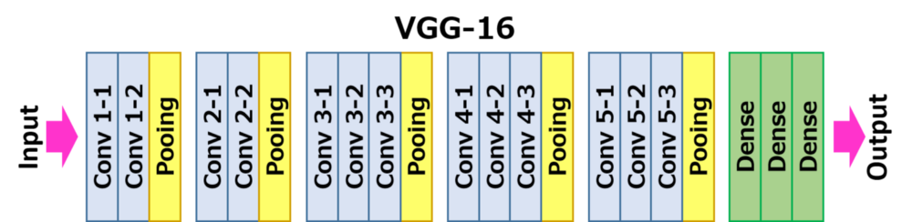


There are two ways to leverage a pre-trained network: *feature extraction* and *fine-tuning*. We will cover both of them. Let's start with feature extraction.

## Feature extraction

Recall that a CNN typically consists of a series of convolutional layers (the 'convolutional base') followed by a few dense/fully-connected layers that use the activation patterns in the final convolutional layer to classify the input image. "Feature extraction" will simply consist of taking the convolutional base of a previously-trained network, running the new data through it, and training a new classifier on top of the output.

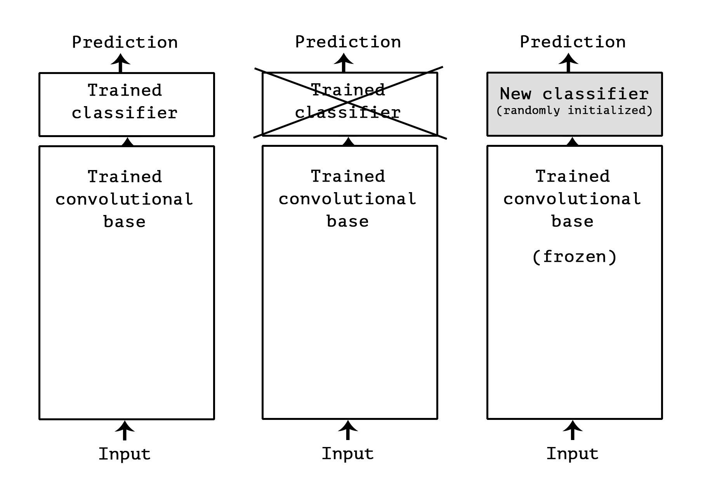


The reason we don't use the dense layers of the pretrained CNN is that, unlike the convolutional base, the features learned by the neurons in the dense layers tend to be specific to the classes that the entire CNN was originally trained on. Additionally, representations found in densely-connected layers no longer contain any information about _where_ objects are located in the input image: these layers get rid of the notion of space, whereas the object location is still described by convolutional feature maps.

Let's begin by using the convolutional base of the VGG16 network, trained on ImageNet, to extract interesting features from our cat and dog images (from the previous tutorial), and then training a cat vs. dog classifier on top of these features.

### Instantiate the VGG model

```{r}
library(keras)

conv_base = application_vgg16(
  weights = "imagenet",
  include_top = FALSE,
  input_shape = c(150, 150, 3)
)
```

We passed three arguments to the constructor:  

* `weights`, to specify which weight checkpoint to initialize the model from.  
* `include_top`, which refers to including or not the densely-connected classifier on top of the network. By default, this densely-connected classifier would correspond to the 1000 classes from ImageNet. Since we intend to use our own densely-connected classifier (with only two classes, cat and dog), we don't need to include it.
* `input_shape`, the shape of the image tensors that we will feed to the network. This argument is purely optional: if we don't pass it, then the network will be able to process inputs of any size.

Let's examine the architecture of the convolutional base:

```{r}
str(conv_base)
```

The final feature map has shape (4, 4, 512). That's the feature on top of which we will stick a densely-connected classifier.

At this point, there are two ways you could proceed:  

1. Running the convolutional base over your dataset, recording its output to an array on disk, and then using this data as input to a standalone, densely connected classifier similar to those you saw in part 1 of this book. This solution is fast and cheap to run, because it only requires running the convolutional base once for every input image, and the convolutional base is by far the most expensive part of the pipeline. But for the same reason, this technique won't allow you to use data augmentation.  
2. Extending the model you have (`conv_base`) by adding dense layers on top, and running the whole thing end to end on the input data. This will allow you to use data augmentation, because every input image goes through the convolutional base every time it's seen by the model. But for the same reason, this technique is far more expensive than the first.

We'll cover both techniques. Let's walk through the code required to set up the first one: recording the output of `conv_base` on your data and using these outputs as inputs to a new model.

### First approach

We'll start by running instances of the previously introduced `image_data_generator()` to extract images as arrays as well as their labels. We will extract features from these images by calling the `predict` method on the model.

```{r}

#We'll reuse the dataset that we previously downloaded from Kaggle
base_dir = "~/Downloads/cats_and_dogs_small"


train_dir = file.path(base_dir, "train")
validation_dir = file.path(base_dir, "validation")
test_dir = file.path(base_dir, "test")

#datagen only rescales the images. No other transformations are applied.
datagen = image_data_generator(rescale = 1/255)
batch_size = 20

#Write a function which takes the location of the images and the number of samples as input and outputs a list containing the activations/predictions of conv_base for each image and the corresponding label of the image.
#Some helpful functions are:
#1) flow_images_from_directory() : to feed images in batches to conv_base. Set class_mode to "binary" because you want the generator to return binary label arrays.
#2) generator_next() : to get the next batch of data
#3) predict() : to get the predictions of conv_base on a given batch
#Keep in mind that the generator outputs batches endlessly. 
extract_features = function(directory, sample_count) {
  
  #Initialize the arrays
  #Note : The final feature map of the conv_base has shape(4,4,512)
  features = array(0, dim = c(sample_count, 4, 4, 512))  
  labels = array(0, dim = c(sample_count))
  
  #
  #
  #
  # TODO
  #
  #
  #
  #
  
  #The list returned by the function
  list(
    features = features, 
    labels = labels
  )
}

# Run this to get the activations (and labels) for the images in the training, validation and test sets
train = extract_features(train_dir, 2000)
validation = extract_features(validation_dir, 1000)
test = extract_features(test_dir, 1000)
```

The extracted features are currently of shape (samples, 4, 4, 512). We will feed them to a densely-connected classifier, so first we must flatten them to `(samples, 8192)`.

```{r}
#Flatten train, validation and test
#TODO
```

At this point, we can define our densely-connected classifier (note the use of dropout for regularization), and train it on the data and labels that we just recorded:

```{r}

#Build a fully connected neural net with a single hidden layer containing 256 units (ReLU)
#Regularize the network by adding dropout(50% rate) to the hidden layer
#Note that this is a binary classification task (the final layer should output a scalar value between 0 and 1)
model = keras_model_sequential() %>% 
#
#
# TODO
#
#

#Compile the model with RMSProp (learning rate of 2e-5), binary_crossentropy loss and accuracy metric.
compile(model,
#TODO


#Train the model for 30 epochs with a batch size of 20.
#Remember to pass the validation data
history = fit(model,
#TODO
```

Training is very fast, since we only have to deal with two Dense layers -- an epoch takes less than one second even on CPU.

Let's take a look at the loss and accuracy curves during training:

```{r}
plot(history)
```

We reach a validation accuracy of about 90%, much better than what we could achieve in the previous section with our small model trained from scratch. However, our plots also indicate that we are overfitting almost from the start -- despite using dropout with a fairly large rate. This is because this technique does not leverage data augmentation, which is essential to preventing overfitting with small image datasets.

### Second Approach

Now, let's review the second technique we mentioned for doing feature extraction, which is much slower and more expensive, but which allows us to leverage data augmentation during training: extending the `conv_base` model and running it end-to-end on the inputs. Note that this technique is in fact so expensive that you should only attempt it if you have access to a GPU: it is absolutely intractable on CPU. If you cannot run your code on GPU, then the previous technique is the way to go.

Because models behave just like layers, you can add a model (like conv_base) to a sequential model just like you would add a layer. So, you can do the following:

```{r eval=FALSE, include=TRUE}
model = keras_model_sequential() %>% 
  conv_base %>% 
  layer_flatten() %>% 
  layer_dense(units = 256, activation = "relu") %>% 
  layer_dense(units = 1, activation = "sigmoid")
```

This is what our model looks like now:

```{r eval=FALSE, include=TRUE}
summary(model)
```

As you can see, the convolutional base of VGG16 has 14,714,688 parameters, which is very large. The classifier we are adding on top has 2 million parameters.

Before you compile and train the model, it's very important to freeze the convolutional base. _Freezing_ a layer or set of layers means preventing their weights from being updated during training. If you don't do this, then the representations that were previously learned by the convolutional base will be modified during training. Because the dense layers on top are randomly initialized, very large weight updates would be propagated through the network, effectively destroying the representations previously learned.

In Keras, you freeze a network using the `freeze_weights()` function:

```{r}
cat("This is the number of trainable weights before freezing",
    "the conv base:", length(model$trainable_weights), "\n")
freeze_weights(conv_base)
cat("This is the number of trainable weights after freezing",
    "the conv base:", length(model$trainable_weights), "\n")
```

With this setup, only the weights from the two dense layers that you added will be trained. That's a total of four weight tensors: two per layer (the main weight matrix and the bias vector). Note that in order for these changes to take effect, you must first compile the model. If you ever modify weight trainability after compilation, you should then recompile the model, or these changes will be ignored.

Now you can start training your model, with the same data-augmentation configuration that we used in the previous tutorial.

```{r}
#Configure the training data generator
#Use the settings from the previous lab
train_datagen = image_data_generator(
#
#TODO
#

#The generator for the test data should only rescale the images
test_datagen = image_data_generator(rescale = 1/255)

#train_generator should yield 150X150 images in batches of 20.
train_generator = flow_images_from_directory(
#
#TODO
#

#validation_generator should also yield 150X150 images in batches of 20.
validation_generator = flow_images_from_directory(
#
#TODO
#

#Compile the model with RMSProp(2e-5) , binary_crossentropy loss and accuracy metric.
compile(model,
#
#TODO
#

#Train the model for 30 epochs (steps_per_epoch = 100)
#Remember to pass validation data (validation_steps = 50)
history = fit_generator(model,
#
#TODO
#

```


```{r}
#save the model to a file named "cats_and_dogs_small_3.h5"
#TODO
```

Let's plot our results again:

```{r}
plot(history)
```

As you can see, we reach a validation accuracy of about 90%.This is much better than our small convnet trained from scratch.

## Fine-Tuning

Another widely used technique for model reuse, complementary to feature extraction, is fine-tuning. Fine-tuning consists in unfreezing a few of the top layers of a frozen model base used for feature extraction, and jointly training both the newly added part of the model (in our case, the fully-connected classifier) and these top layers. This is called "fine-tuning" because it slightly adjusts the more abstract representations of the model being reused, in order to make them more relevant for the problem at hand.


We have stated before that it was necessary to freeze the convolution base of VGG16 in order to be able to train a randomly initialized classifier on top. For the same reason, it is only possible to fine-tune the top layers of the convolutional base once the classifier on top has already been trained. If the classified wasn't already trained, then the error signal propagating through the network during training would be too large, and the representations previously learned by the layers being fine-tuned would be destroyed. Thus the steps for fine-tuning a network are as follows:  

* 1) Add your custom network on top of an already trained base network.
* 2) Freeze the base network.
* 3) Train the part you added.
* 4) Unfreeze some layers in the base network.
* 5) Jointly train both these layers and the part you added.

As a reminder, this is what our convolutional base looks like:

```{r}
summary(conv_base)
```

We will fine-tune all of the layers from `block3_conv1` and on. Why not fine-tune more layers? Why not fine-tune the entire convolutional base? We could. However, we need to consider that:

* Earlier layers in the convolutional base encode more generic, reusable features, while layers higher up encode more specialized features. It is more useful to fine-tune the more specialized features, as these are the ones that need to be repurposed on our new problem. There would be fast-decreasing returns in fine-tuning lower layers.
* The more parameters we are training, the more we are at risk of overfitting. The convolutional base has 15M parameters, so it would be risky to attempt to train it on our small dataset.  

Thus, in our situation, it is a good strategy to only some of the layers in the convolutional base.

Let's set this up, starting from where we left off in the previous example:

```{r}
unfreeze_weights(conv_base, from = "block3_conv1")
```

Now we can start fine-tuning our network. We will do this with the RMSprop optimizer, using a very low learning rate. The reason for using a low learning rate is that we want to limit the magnitude of the modifications we make to the representations of the layers that we are fine-tuning. Updates that are too large may harm these representations.

Now let's proceed with fine-tuning:

```{r, echo=TRUE, results='hide'}
compile(model,
  loss = "binary_crossentropy",
  optimizer = optimizer_rmsprop(lr = 1e-5),
  metrics = c("accuracy")
)

history = fit_generator(model,
  train_generator,
  steps_per_epoch = 100,
  epochs = 100,
  validation_data = validation_generator,
  validation_steps = 50
)
```

```{r}
save_model_hdf5(model, "cats_and_dogs_small_4.h5")
```

Let's plot our results using the same plotting code as before:

```{r}
plot(history)
```

We are seeing a nice 6% absolute improvement in accuracy, from about 90% to above 96%.

Note that the loss curve doesn't show any real improvement (in fact, it's deteriorating). You may wonder, how could accuracy stay stable or improve if the loss isn't decreasing? The answer is simple: what you display is an average of pointwise loss values; but what matters for accuracy is the distribution of the loss values, not their average, because accuracy is the result of a binary thresholding of the class probability predicted by the model. The model may still be improving even if this isn't reflected in the average loss.

We can now finally evaluate this model on the test data:


```{r}
#test_generator should yield (150,150) images in batches of 20.
test_generator = flow_images_from_directory(
#TODO

#Evaluate the model
evaluate_generator(model, test_generator, steps = 50)
```

Here we get a test accuracy of 96.5%. In the original Kaggle competition around this dataset, this would have been one of the top results. However, using modern deep learning techniques, we managed to reach this result using only a very small fraction of the training data available (about 10%). There is a huge difference between being able to train on 20,000 samples compared to 2,000 samples!

## Take-aways: using convnets with small datasets

Here's what you should take away from these exercises:  

Convnets are the best type of machine learning models for computer vision tasks. It is possible to train one from scratch even on a very small dataset, with decent results.  
*On a small dataset, overfitting will be the main issue. Data augmentation is a powerful way to fight overfitting when working with image data.  
*It is easy to reuse an existing convnet on a new dataset, via feature extraction. This is a very valuable technique for working with small image datasets.  
*As a complement to feature extraction, one may use fine-tuning, which adapts to a new problem some of the representations previously learned by an existing model. This pushes performance a bit further.  

Now you have a solid set of tools for dealing with image classification problems, in particular with small datasets.

#Exercise 2: Visualizing convnets

It is often said that deep learning models are "black boxes", learning representations that are difficult to extract and present in a human-readable form. While this is partially true for certain types of deep learning models, it is definitely not true for convnets. The representations learned by convnets are highly amenable to visualization, in large part because they are _representations of visual concepts_. Since 2013, a wide array of techniques have been developed for visualizing and interpreting these representations. We won't survey all of them, but we will cover three of the most accessible and useful ones:

* Visualizing intermediate convnet outputs ("intermediate activations"). This is useful to understand how successive convnet layers transform their input, and to get a first idea of the meaning of individual convnet filters.
* Visualizing convnets filters. This is useful to understand precisely what visual pattern or concept each filter in a convnet is receptive to.
* Visualizing heatmaps of class activation in an image. This is useful to understand which part of an image where identified as belonging to a given class, and thus allows to localize objects in images.

For the first method -- activation visualization -- we will use the small convnet that we trained from scratch on the cat vs. dog classification problem in the previous lab. For the next two methods, we will use the VGG16 model that we introduced in the previous section.

## Visualizing intermediate activations

Visualizing intermediate activations consists in displaying the feature maps that are output by various convolution and pooling layers in a network, given a certain input (the output of a layer is often called its "activation", the output of the activation function). This gives a view into how an input is decomposed unto the different filters learned by the network. These feature maps we want to visualize have 3 dimensions: width, height, and depth (channels). Each channel encodes relatively independent features, so the proper way to visualize these feature maps is by independently plotting the contents of every channel, as a 2D image. Let's start by loading the model that we saved in section 5.2:

```{r}

model = load_model_hdf5("cats_and_dogs_small_2.h5")
summary(model)  # As a reminder.
```

This will be the input image we will use -- a picture of a cat, not part of images that the network was trained on:

```{r}
img_path = "~/Downloads/cats_and_dogs_small/test/cats/cat.1700.jpg"

# We preprocess the image into a 4D tensor
img = image_load(img_path, target_size = c(150, 150))
img_tensor = image_to_array(img)
img_tensor = array_reshape(img_tensor, c(1, 150, 150, 3))

# Remember that the model was trained on inputs
# that were preprocessed in the following way:
img_tensor = img_tensor / 255

dim(img_tensor)
```

Let's display our picture:

```{r}
plot(as.raster(img_tensor[1,,,]))
```

In order to extract the feature maps you want to look at, you'll create a Keras model that takes batches of images as input, and outputs the activations of all convolution and pooling layers. To do this, we will use the `keras_model()` function, which takes two arguments: an input tensor (or list of input tensors) and an output tensor (or list of output tensors). The resulting class is a Keras model, just like the ones created by the `keras_sequential_model()` function that you are familiar with, mapping the specified inputs to the specified outputs. What sets this type of model apart apart is that it allows for models with multiple outputs (unlike `keras_sequential_model()`). For more information about creating models with the `keras_model()` function, see section 7.1 of the book.

```{r}
# Extracts the outputs of the top 8 layers:
layer_outputs = lapply(model$layers[1:8], function(layer) layer$output)
# Creates a model that will return these outputs, given the model input:
activation_model = keras_model(inputs = model$input, outputs = layer_outputs)
```

When fed an image input, this model returns the values of the layer activations in the original model. This is the first time you encounter a multi-output model : until now the models you have seen only had exactly one input and one output. In the general case, a model could have any number of inputs and outputs. This one has one input and 8 outputs, one output per layer activation.

```{r}
# Returns a list of five arrays: one array per layer activation
activations =  predict(activation_model, img_tensor)
```

For instance, this is the activation of the first convolution layer for our cat image input:

```{r}
first_layer_activation = activations[[1]]
dim(first_layer_activation)
```

It's a 148 x 148 feature map with 32 channels. Let's visualize some of them. First we define an R function 
that will plot a channel:

```{r}
plot_channel = function(channel) {
  rotate = function(x) t(apply(x, 2, rev))
  image(rotate(channel), axes = FALSE, asp = 1, 
        col = terrain.colors(12))
}
```

Let's try visualizing the 5th channel:

```{r}
#Plot the fifth channel
#TODO
```


This channel appears to encode some sort of edge detector. Let's try the 7th channel -- but note that your own channels may vary, since the  specific filters learned by convolution layers are not deterministic.

```{r}
#Plot the seventh channel
#TODO

```

This channel is subtly different, and unlike the 5th channel seems to be picking up the iris of the cat's eye. At this point, let's go and plot a complete visualization of all the activations in the network. We'll extract and plot every channel in each of our 8 activation maps, and we will stack the results in one big image tensor, with channels stacked side by side.

```{r}
dir.create("cat_activations")
image_size = 58
images_per_row = 16

for (i in 1:8) {
  
  layer_activation = activations[[i]]
  layer_name = model$layers[[i]]$name
 
  n_features = dim(layer_activation)[[4]]
  n_cols = n_features %/% images_per_row
 
  png(paste0("cat_activations/", i, "_", layer_name, ".png"), 
      width = image_size * images_per_row, 
      height = image_size * n_cols)
  op = par(mfrow = c(n_cols, images_per_row), mai = rep_len(0.02, 4))
  
  for (col in 0:(n_cols-1)) {
    for (row in 0:(images_per_row-1)) {
      channel_image = layer_activation[1,,,(col*images_per_row) + row + 1]
      plot_channel(channel_image)
    }
  }
  
  par(op)
  dev.off()
}
```

***

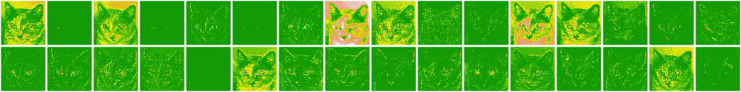

***

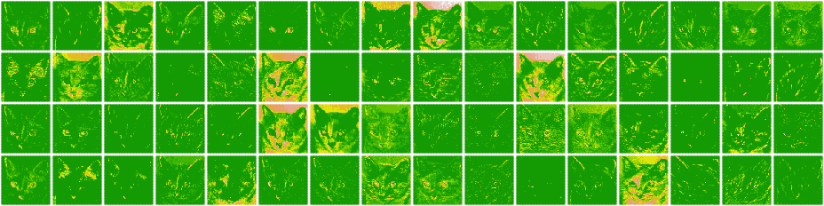

***

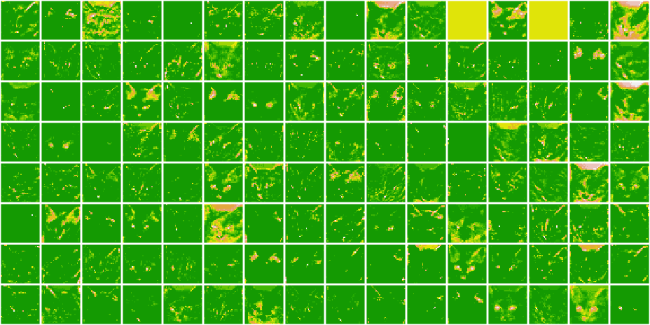

***

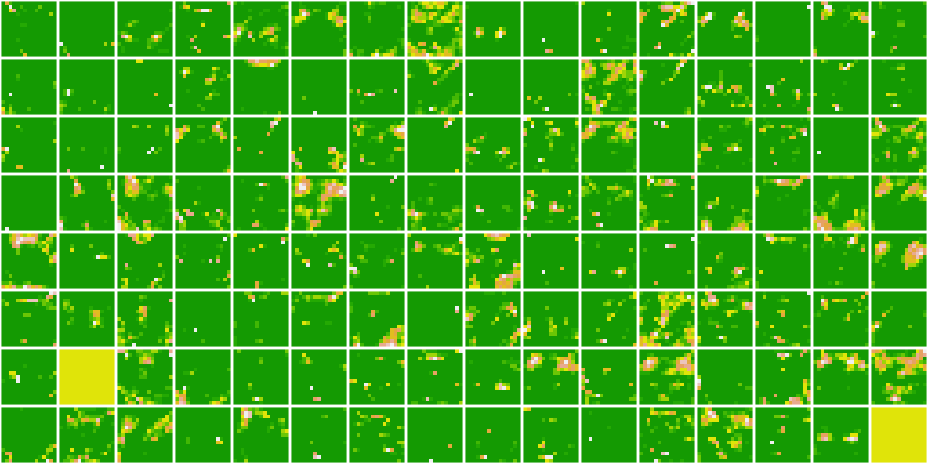

***

A few remarkable things to note here:

* The first layer acts as a collection of various edge detectors. At that stage, the activations are still retaining almost all of the information present in the initial picture.
* As we go higher-up, the activations become increasingly abstract and less visually interpretable. They start encoding higher-level concepts such as "cat ear" or "cat eye". Higher-up presentations carry increasingly less information about the visual contents of the image, and increasingly more information related to the class of the image.
* The sparsity of the activations is increasing with the depth of the layer: in the first layer, all filters are activated by the input image, but in the following layers some filters are blank. This means that the pattern encoded by the filter isn't found in the input image.

We have just evidenced a very important universal characteristic of the representations learned by deep neural networks: the features extracted by a layer get increasingly abstract with the depth of the layer. The activations of layers higher-up carry less and less information about the specific input being seen, and more and more information about the target (in our case, the class of the image: cat or dog). A deep neural network effectively acts as an __information distillation pipeline__, with raw data going in (in our case, RBG pictures), and getting repeatedly transformed so that irrelevant information gets filtered out (e.g. the specific visual appearance of the image) while useful information get magnified and refined (e.g. the class of the image).

This is analogous to the way humans and animals perceive the world: after observing a scene for a few seconds, a human can remember which abstract objects were present in it (e.g. bicycle, tree) but could not remember the specific appearance of these objects. In fact, if you tried to draw a generic bicycle from mind right now, chances are you could not get it even remotely right, even though you have seen thousands of bicycles in your lifetime. Try it right now: this effect is absolutely real. You brain has learned to completely abstract its visual input, to transform it into high-level visual concepts while completely filtering out irrelevant visual details, making it 
tremendously difficult to remember how things around us actually look.

## Visualizing convnet filters


Another easy thing to do to inspect the filters learned by convnets is to display the visual pattern that each filter is meant to respond to. This can be done with __gradient ascent in input space__: applying __gradient descent__ to the value of the input image of a convnet so as to maximize the response of a specific filter, starting from a blank input image. The resulting input image would be one that the chosen filter is maximally responsive to.

The process is simple: we will build a loss function that maximizes the value of a given filter in a given convolution layer, then we will use stochastic gradient descent to adjust the values of the input image so as to maximize this activation value. For instance, here's a loss for the activation of filter 0 in the layer "block3_conv1" of the VGG16 network, pre-trained on ImageNet:

```{r}

model = application_vgg16(
  weights = "imagenet", 
  include_top = FALSE
)

layer_name = "block3_conv1"
filter_index = 1

layer_output = get_layer(model, layer_name)$output
loss = k_mean(layer_output[,,,filter_index])
```

To implement gradient descent, we will need the gradient of this loss with respect to the model's input. To do this, we will use the `k_gradients` Keras backend function:

```{r}
# The call to `gradients` returns a list of tensors (of size 1 in this case)
# hence we only keep the first element -- which is a tensor.
grads = k_gradients(loss, model$input)[[1]] 
```

A non-obvious trick to use for the gradient descent process to go smoothly is to normalize the gradient tensor, by dividing it by its L2 norm (the square root of the average of the square of the values in the tensor). This ensures that the magnitude of the updates done to the input image is always within a same range.

```{r}
# Normalize the gradient tensor using the functions k_sqrt, k_mean and k_square.
# Add 1e-5 before dividing so as to avoid accidentally dividing by 0.
grads = #TODO
```

Now you need a way to compute the value of the loss tensor and the gradient tensor, given an input image. You can define a Keras backend function to do this: `iterate` is a function that takes a tensor (as a list of tensors of size 1) and returns a list of two  tensors: the loss value and the gradient value.

```{r}
iterate = k_function(list(model$input), list(loss, grads))

# Let's test it
c(loss_value, grads_value) %=%
    iterate(list(array(0, dim = c(1, 150, 150, 3))))
```

At this point we can define an R loop to do stochastic gradient ascent:

```{r}
# We start from a gray image with some noise
input_img_data =
  array(runif(150 * 150 * 3), dim = c(1, 150, 150, 3)) * 20 + 128 

step = 1  # this is the magnitude of each gradient update

#Write a for loop to perform stochastic gradient ASCENT for 40 steps. For each step:
#1)Compute the loss value and gradient value
#2)Adjust the input image in the direction that maximizes the loss

#TODO

```

The resulting image tensor is a floating-point tensor of shape `(1, 150, 150, 3)`, with values that may not be integers within [0, 255]. Hence you need to post-process this tensor to turn it into a displayable image. You do so with the following straightforward utility function.

```{r}
deprocess_image = function(x) {
 
  dms = dim(x)
  
  # normalize tensor: center on 0., ensure std is 0.1
  x = x - mean(x) 
  x = x / (sd(x) + 1e-5)
  x = x * 0.1 
  
  # clip to [0, 1]
  x = x + 0.5 
  x = pmax(0, pmin(x, 1))
  
  # Reshape to original image dimensions
  array(x, dim = dms)
}
```

Now you have all the pieces. Let's put them together into an R function that takes as input a layer name and a filter index, and  returns a valid image tensor representing the pattern that maximizes the activation of the specified filter.

```{r}
generate_pattern = function(layer_name, filter_index, size = 150) {
  
  # Build a loss function that maximizes the activation
  # of the nth filter of the layer considered.
  layer_output = model$get_layer(layer_name)$output
  loss = k_mean(layer_output[,,,filter_index]) 
  
  # Compute the gradient of the input picture wrt this loss
  grads = k_gradients(loss, model$input)[[1]]
  
  # Normalization trick: we normalize the gradient
  # Paste the code you wrote earlier 
  # TODO
  
  # This function returns the loss and grads given the input picture
  iterate = k_function(list(model$input), list(loss, grads))
  
  # We start from a gray image with some noise
  input_img_data = 
    array(runif(size * size * 3), dim = c(1, size, size, 3)) * 20 + 128
  
  # Run gradient ascent for 40 steps
  step = 1
  # Paste the code you wrote earlier for gradient ascent
  # TODO
  
  img = input_img_data[1,,,]
  deprocess_image(img) 
}
```

Let's try this:

```{r}
library(grid)
grid.raster(generate_pattern("block3_conv1", 1))
```

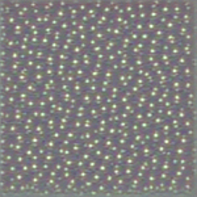

<br/>

It seems that filter 1 in layer `block3_conv1` is responsive to a polka dot pattern.

Now the fun part: we can start visualising every single filter in every layer. For simplicity, we will only look at the first 64 filters in 
each layer, and will only look at the first layer of each convolution block (block1_conv1, block2_conv1, block3_conv1, block4_conv1, 
block5_conv1). We will arrange the outputs on a 8x8 grid of filter patterns.

```{r}
library(grid)
library(gridExtra)
dir.create("vgg_filters")
for (layer_name in c("block1_conv1", "block2_conv1", 
                     "block3_conv1", "block4_conv1")) {
  size = 140
  
  png(paste0("vgg_filters/", layer_name, ".png"),
      width = 8 * size, height = 8 * size)
  
  grobs = list()
  for (i in 0:7) {
    for (j in 0:7) {
      pattern = generate_pattern(layer_name, i + (j*8) + 1, size = size)
      grob = rasterGrob(pattern, 
                         width = unit(0.9, "npc"), 
                         height = unit(0.9, "npc"))
      grobs[[length(grobs)+1]] = grob
    }  
  }
  
  grid.arrange(grobs = grobs, ncol = 8)
  dev.off()
}
```

***

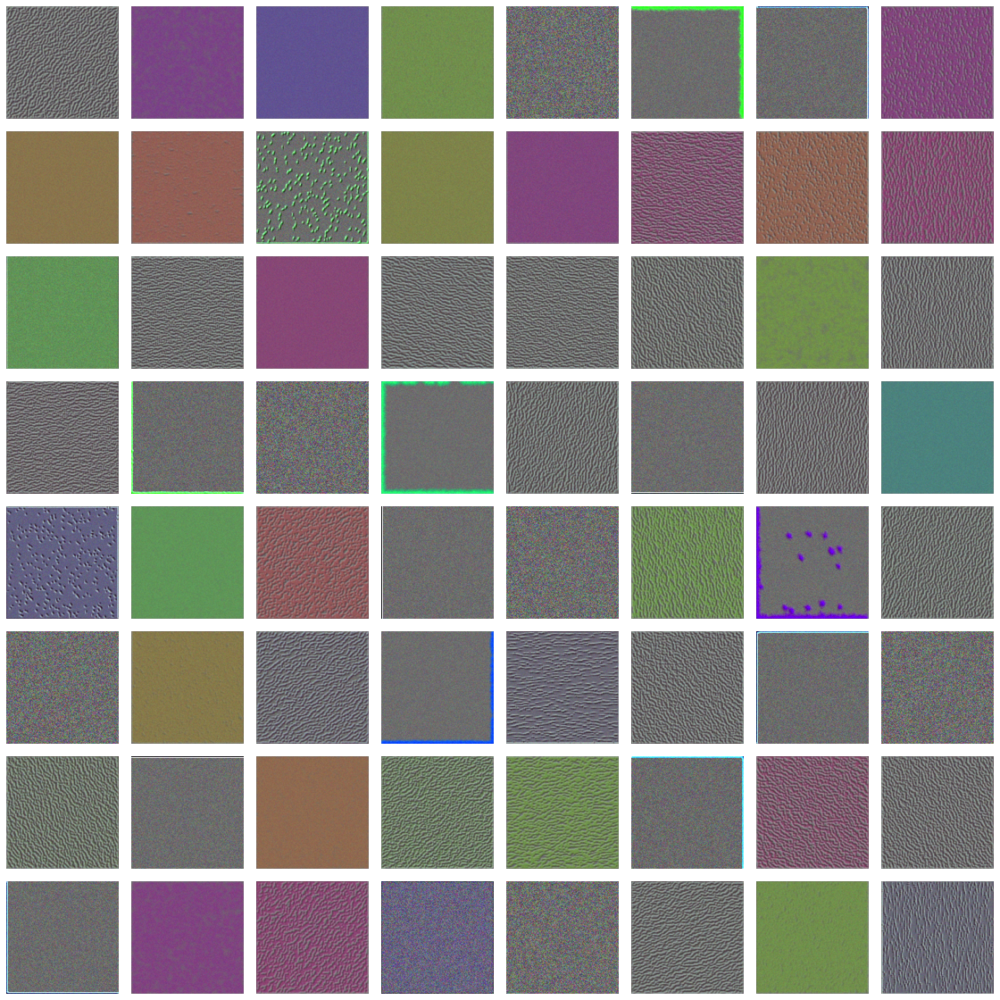

***

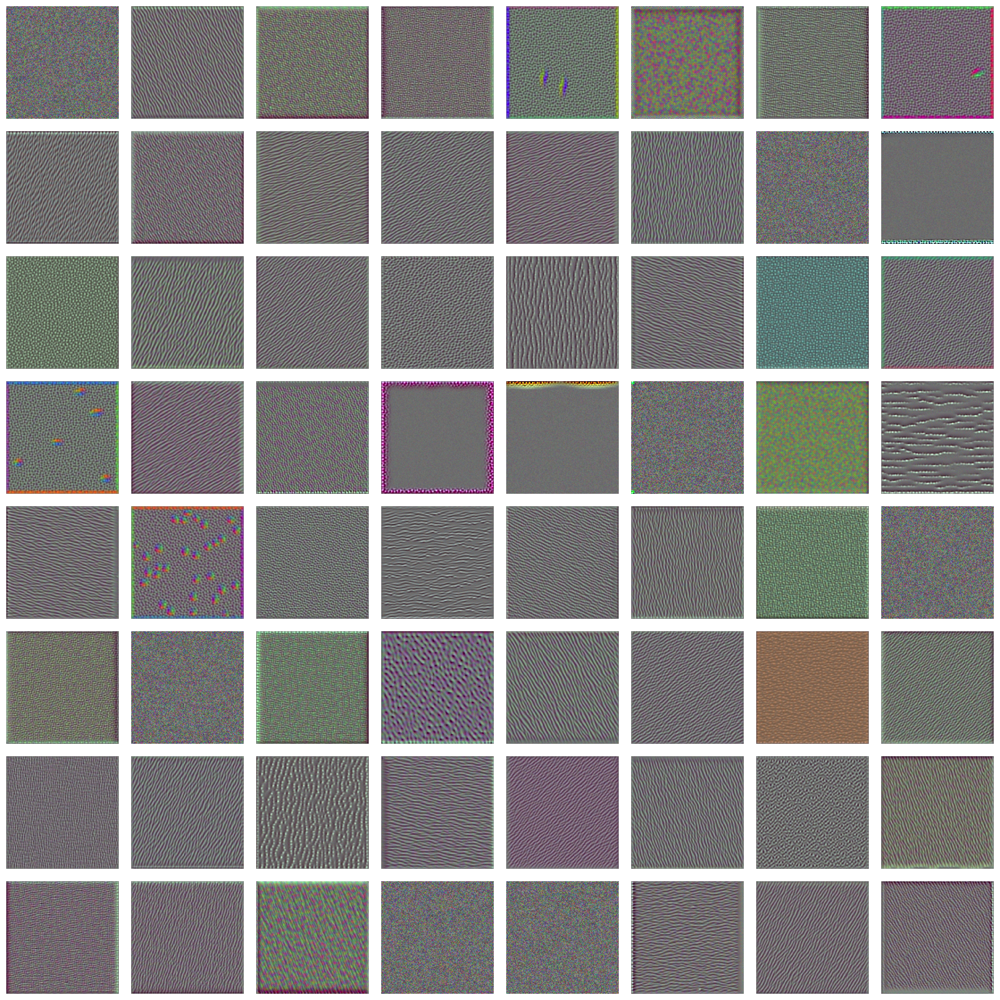

***

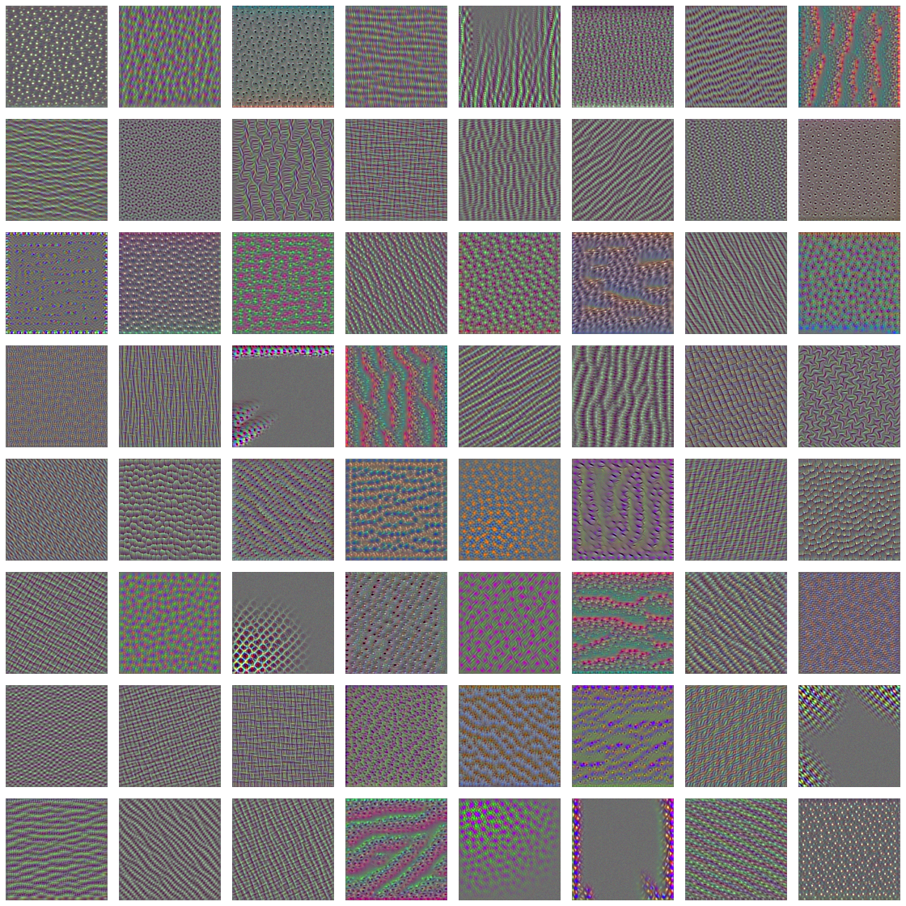

***

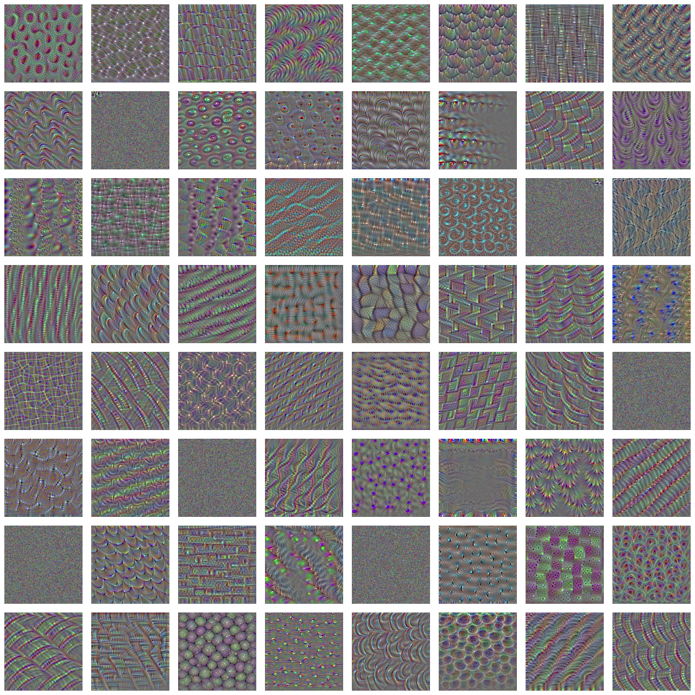

***

These filter visualizations tell you a lot about how convnet layers see the world: each layer in a convnet learns a collection of filters such that their inputs can be expressed as a combination of the filters. This is similar to how the Fourier transform decomposes signals onto a bank of cosine functions. The filters in these convnet filter banks get increasingly complex and refined as you go higher in the model:

* The filters from the first layer in the model (`block1_conv1`) encode simple directional edges and colors (or colored edges in some cases).
* The filters from `block2_conv1` encode simple textures made from combinations of edges and colors.
* The filters in higher layers begin to resemble textures found in natural images: feathers, eyes, leaves, and so on.

## Visualizing heatmaps of class activation

We'll introduce one more visualization technique: one that is useful for understanding which parts of a given image led a convnet to its final classification decision. This is helpful for debugging the decision process of a convnet, particularly in the case of a classification mistake. It also allows you to locate specific objects in an image.

This general category of techniques is called _class activation map_ (CAM) visualization, and it consists of producing heatmaps of class activation over input images. A class-activation heatmap is a 2D grid of scores associated with a specific output class, computed for every location in any input image, indicating how important each location is with respect to the class under consideration. For instance, given an image fed into a cat-versus-dog convnet, CAM visualization allows you to generate a heatmap for the class "cat," indicating how cat-like different parts of the image are, and also a heatmap for the class "dog," indicating how dog-like parts of the image are.

The specific implementation you'll use is the one described in "Grad-CAM: Visual Explanations from Deep Networks via Gradient-based Localization."footnote:[Ramprasaath R. Selvaraju et al., Cornell University Library, March 21, 2017, https://arxiv.org/abs/1610.02391.]. It's very simple: it consists of taking the output feature map of a convolution layer, given an input image, and weighing every channel in that feature map by the gradient of the class with respect to the channel. Intuitively, one way to understand this trick is that you're weighting a spatial map of "how intensely the input image activates different channels" by "how important each channel is with regard to the class," resulting in a spatial map of "how intensely the input image activates the class."

We'll demonstrate this technique using the pretrained VGG16 network again.

```{r}
# Clear out the session
k_clear_session()

# Note that we are including the densely-connected classifier on top;
# all previous times, we were discarding it.
model = application_vgg16(weights = "imagenet")
```

Let's consider the following image of two African elephants, possible a mother and its cub, strolling in the savanna (under a Creative 
Commons license):


Let's convert this image into something the VGG16 model can read: the model was trained on images of size 224 x 244, preprocessed according to a few rules that are packaged in the utility function `imagenet_preprocess_input()`. So you need to load the image, resize it to 224 x 224, convert it to an array, and apply these preprocessing rules.

```{r}
# The local path to our target image
img_path = "~/Downloads/creative_commons_elephant.jpg"
  
# Start with image of size 224 x 224
img = image_load(img_path, target_size = c(224, 224)) %>% 
  # Array of shape (224, 224, 3)
  image_to_array() %>% 
  # Adds a dimension to transform the array into a batch of size (1, 224, 224, 3)
  array_reshape(dim = c(1, 224, 224, 3)) %>% 
  # Preprocesses the batch (this does channel-wise color normalization)
  imagenet_preprocess_input()
```


You can now run the pretrained network on the image and decode its prediction vector back to a human-readable format:

```{r}
preds = model %>% predict(img)
imagenet_decode_predictions(preds, top = 3)[[1]]
```

The top-3 classes predicted for this image are:

* African elephant (with 90.9% probability)
* Tusker (with 8.6% probability)
* Indian elephant (with 0.4% probability)

Thus our network has recognized our image as containing an undetermined quantity of African elephants. The entry in the prediction vector 
that was maximally activated is the one corresponding to the "African elephant" class, at index 387:

```{r}
which.max(preds[1,])
```

To visualize which parts of our image were the most "African elephant"-like, let's set up the Grad-CAM process:

```{r}

# Use the result above to assign the "african elephant" entry in the model output to african_elephant_output
african_elephant_output = #TODO

# Assign  `block5_conv3` layer (which is the last convolutional layer of VGG16) to last_conv_layer by calling get_layer()
last_conv_layer = #TODO


#grads should hold the gradient of the "african elephant" class with regard to the output feature map of `block5_conv3`
#You need the function k_gradients (See the previous section for an example)
grads = #TODO

#pooled_grads must be a vector of shape (512,), where each entry is the mean intensity of the gradient over a specific feature map channel
#Hint : https://keras.rstudio.com/reference/k_mean.html
pooled_grads = #TODO

# This function allows us to access the values of the quantities we just defined:
# `pooled_grads` and the output feature map of `block5_conv3`,
# given a sample image
iterate = k_function(list(model$input),
                      list(pooled_grads, last_conv_layer$output[1,,,])) 

# These are the values of these two quantities, as arrays,
# given our sample image of two elephants
c(pooled_grads_value, conv_layer_output_value) %=% iterate(list(img))

# Write a for loop to multiply each channel in the feature map array by "how important this channel is" with regard to the elephant class
# TODO

# The channel-wise mean of the resulting feature map
# is our heatmap of class activation
heatmap = apply(conv_layer_output_value, c(1,2), mean)
```

For visualization purposes, you'll also normalize the heatmap between 0 and 1. The result is shown in figure 5.35.

```{r}
heatmap = pmax(heatmap, 0) 
heatmap = heatmap / max(heatmap)

write_heatmap = function(heatmap, filename, width = 224, height = 224,
                          bg = "white", col = terrain.colors(12)) {
  png(filename, width = width, height = height, bg = bg)
  op = par(mar = c(0,0,0,0))
  on.exit({par(op); dev.off()}, add = TRUE)
  rotate = function(x) t(apply(x, 2, rev))
  image(rotate(heatmap), axes = FALSE, asp = 1, col = col)
}

write_heatmap(heatmap, "images/elephant_heatmap.png") 
```


<br/>

Finally, we will use the *magick* package to generate an image that superimposes the original image with the heatmap we just obtained:

```{r}
library(magick) 
library(viridis) 

# Read the original elephant image and it's geometry
image = image_read(img_path)
info = image_info(image) 
geometry = sprintf("%dx%d!", info$width, info$height) 

# Create a blended / transparent version of the heatmap image
pal = col2rgb(viridis(20), alpha = TRUE) 
alpha = floor(seq(0, 255, length = ncol(pal))) 
pal_col = rgb(t(pal), alpha = alpha, maxColorValue = 255)
write_heatmap(heatmap, "images/elephant_overlay.png", 
              width = 14, height = 14, bg = NA, col = pal_col) 

# Overlay the heatmap
image_read("images/elephant_overlay.png") %>% 
  image_resize(geometry, filter = "quadratic") %>% 
  image_composite(image, operator = "blend", compose_args = "20") %>%
  plot() 
```


This visualisation technique answers two important questions:

* Why did the network think this image contained an African elephant?
* Where is the African elephant located in the picture?

In particular, it is interesting to note that the ears of the elephant cub are strongly activated: this is probably how the network can 
tell the difference between African and Indian elephants.


