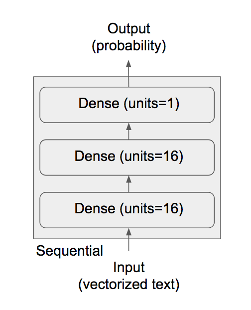
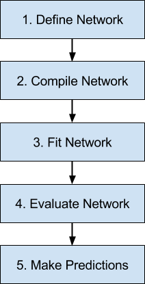

```{r setup, include=FALSE}
knitr::opts_chunk$set(eval = FALSE, echo = TRUE)
```

## Exercise 1 : Binary Classification

Welcome to the first lab session.

This exercise is a binary classification task. The goal is to train a neural network in Keras to classify movie reviews as either 'positive' or 'negative' reflecting the sentiment of the reviewers.

The dataset that we'll be working with is the IMDB dataset which is included in Keras. It contains 50,000 reviews that are highly polarized(that is, they are unambiguously either 'positive' or 'negative'). When the data is loaded, the training and test sets will contain 25,000 reviews each. In both sets, 50% of the reviews will be 'postive'(and 50% will be 'negative').

Each review is represented as a sequence of integers, where each integer corresponds to a specific word in a dictionary and the length of the sequence is the number of words in the review.

First, we load the Keras package
```{r}
library(keras)
```

Then, we load the dataset.
```{r}

# The argument num_words = 10000 specifies that we only keep the top 10,000 most frequently occuring words in the (training) data (just for convenience). This will take a minute or two.
imdb = dataset_imdb(num_words = 10000)

# The variables train_data , train_labels, test_data and test_labels will now contain the corresponding values
train_data = imdb$train$x
train_labels = imdb$train$y
test_data = imdb$test$x
test_labels = imdb$test$y
```

The variables `train_data` and `test_data` are lists of reviews, each review being a list of word indices (encoding a sequence of words). `train_labels` and `test_labels` are lists of 0s and 1s, where 0 stands for "negative" and 1 stands for "positive":

```{r}
str(train_data[[1]])
```

```{r}
train_labels[[1]]
```

Since we restricted ourselves to the top 10,000 most frequent words, no word index will exceed 10,000:

```{r}
max(sapply(train_data, max))
```

For kicks, here's how you can quickly decode one of these reviews back to English words:

```{r}
# word_index is a dictionary mapping words to an integer index
word_index = dataset_imdb_word_index()
# We reverse it, mapping integer indices to words
reverse_word_index = names(word_index)
names(reverse_word_index) = word_index
# We decode the review; note that our indices were offset by 3
# because 0, 1 and 2 are reserved indices for "padding", "start of sequence", and "unknown".
decoded_review = sapply(train_data[[1]], function(index) {
  word = if (index >= 3) reverse_word_index[[as.character(index - 3)]]
  if (!is.null(word)) word else "?"
})
```

```{r}
cat(decoded_review)
```

## Preparing the data

Before we feed the reviews to the network, we first convert them from sequences of integers to "one-hot-coded" vectors. For example, turning the sequence (3,5,9) into a 10 dimensional one-hot-coded vector gives us (0,0,1,0,1,0,0,0,1,0) which has a 1 in the positions 3, 5 and 9 and zeros everywhere else.


```{r}

# Write a function which takes two arguments:
#   1) a list of sequences(reviews), and,
#   2) the dimensionality of the one-hot-coded vectors(in our case : 10,000)
# and returns a matrix containing the one-hot-coded vectors as rows. That is, the matrix will have 10000 columns and the number of rows is the number of elements in the input list.

vectorize_sequences = function(sequences, dimension = 10000) {
# TODO
}

# Transform the training and test data
x_train = vectorize_sequences(train_data)
x_test = vectorize_sequences(test_data)

```


Here's a sample from the transformed data

```{r}
str(x_train[1,])
```

Finally, we convert the 'integer' labels to 'numeric' labels
```{r}
y_train = as.numeric(train_labels)
y_test = as.numeric(test_labels)
```

Our data is now ready to be fed to a neural network.

## Building the network

When deciding on an architecture for a neural network, the two key things to consider are:
*the number of hidden layers in the network , and,
*the number of neurons in each of the hidden layers

Increasing the depth of the network(that is, adding layers) or increasing the number of neurons in a given layer will increase the capacity of the network and allow it to learn more complex non-linear decision boundaries. However, making the network too large can lead to overfitting (where the performance of the network on the test data is much worse than the performance on the training data).

In practice, deciding on an architecture is an iterative process where a whole bunch of different networks are trained in order to find a good setting for the hyperparameters. For this exercise, however, we'll build a simple neural network based on the figure below.




It is a simple feedforward neural network with two fully-connected hidden layers consisting of 16 neurons each and a single output neuron which outputs a scalar value (between 0 and 1) representing the probability of the review being 'positive'.

Keras has two main APIs for building neural nets : Sequential and Functional. In this exercise, we'll work with the Sequential API.

The most important concepts in Keras are 'layers' and 'models'. As you'd expect, a layer in Keras reprents a layer in the neural network and a model represents the entire network.

Keras has fully connected layers, convolutional layers, pooling layers, LSTMs , etc.To build a neural net using the Sequential API, you essentially "stack" a whole bunch of these layers sequentially.

```{r}

#keras_model_sequential() initializes the Sequential model. Layers are then added to the model by using the %>% operator as such : {Sequential} %>% {Layer1} %>% {Layer2} ... and so on.

#Build out the network shown in the figure above using the layer_dense function (refer to docs) : #https://www.rdocumentation.org/packages/keras/versions/2.2.0/topics/layer_dense
#The first hidden layer has already been added. It consists of 16 neurons.
#Stack the other two layers in the figure above. The second hidden layer has a ReLU activation and the output layer has a sigmoid activation.
#You only need to specify the input_size to the first hidden layer. For the other two, this argument can be skipped.

model = keras_model_sequential() %>%
    layer_dense(units = 16, activation = "relu", input_shape = c(10000)) %>%
    #TODO

```

## Compile

So, we've built our model. Before we can train the network, however, we must specify:
1) The loss function to use (mean squared error, cross_entropy, etc)
2) The optimizer (SGD, Adam, RMSProp, etc. This will be covered in detail in a later lecture.)
3) Any metrics (such as accurary) used to measure the performance of the model
*Note : this is different from the loss function which is used to train the model)

To do this, we call the 'compile' function. The argument(s) passed to compile can be a string, such as "rmsprop", or the corresponding function instance, optimizer_rmsprop(), which is included in the Keras package. The same works for losses and metrics by passing function objects.

```{r}

#Compile the model by choosing RMSProp as the optimizer, binary cross-entropy(since this is a binary classification task) as the loss and accuracy as the metric.
#Note : The default learning rate for RMSProp is 0.001.
#Note : The metric(s) must be passed as a vector argument.

compile(model,
#TODO
)

```

### Validation set

We are now ready to train the model. Before we do so, let's create a validation set to monitor the (generalization) performance of the model during training.

```{r}

# Create a validation set by setting aside the first 10,000 samples of the training data. The (modified) training set should now contain only the remaining 15,000 samples.
# When you're done, you'll have 4 objects : 2 containing the features of the validation and (modified) training set and 2 containing the corresponding labels.

#TODO

```

## Fit

Let's train the model that we've compiled by calling the fit() function.

Recall that a neural net is trained iteratively on 'batches' of the training data. One full sweep over the training set is called an 'epoch'. The corresponding parameters of fit() are batch_size and epochs.

Training a neural network on the entire dataset(in one iteration) can be computationally expensive/infeasible and training it for too many epochs can result in overfitting. Therefore, it is very important to choose the right values for these parameters.

fit() returns an object which contains the values of the losses and metrics at the end of every epoch. If a validation set is passed, the corresponding values on the validation set are also returned.

```{r}

# Train the model by passing the training and validation sets to fit(). Remember to specify the batch size and total number of epochs.For starters, try a batch size of 512 and 20 epochs.
# The validation data must be passed as a list containing the validation features and validation labels to the validation_data parameter.
# https://keras.rstudio.com/reference/fit.html


history = fit(model,
#TODO
)
```

 Let's inspect the history object:

```{r}
str(history)
```

As you can see, it contains both the parameters passed to fit() and the losses and metrics at the end of each epoch (history$metrics)

It's very convenient to plot the metrics by calling the plot() function of the history object

```{r}
plot(history)
```

As expected, the training loss decreases with each epoch (and training accuracy increases). However, the validation loss decreases initially and then begins to increase after the fourth epoch. Therefore, the network has overfit.

An easy fix is to automatically stop training once the validation accurary starts to increase. We'll look at a simple way to do this later using 'callback' objects in Keras. For now, let's just train a new network for just 4 epochs.

```{r}

#Build, compile and train a new network with the same architecture as the previous one. The only difference is the number of epochs(4, this time).
#Use the entire training set this time : (x_train and y_train)

#TODO

```
### Evaluate

Let's evaluate the performance of the model on the test set by calling the evaluate() function:

```{r}
# Call the evaluate() function on the model and assign the output to a variable named 'results'.
# The function takes two arguments: the features of the test set and the associated labels.

#TODO
```


```{r}
#The performance on the test set is

results

```

Our simple model does reasonably well. It achieves an accuracy of approximately 88%.

### Predict

Finally, to generate the likelihood of the reviews being positive, we call the predict() function:

```{r}
# Get the predictions of the model for the first ten reviews in the test set. Call predict()

# TODO

```


OPTINAL : Play around with the code by adding and deleting layers, changing the hidden activation, optimizer, learning rate, batch-size, etc.

```{r}
# OPTIONAL : Try to improve the (test) performance of the model by tweaking the hyperparameters.

```

## Conclusion

Here's what you should take away from this example:

* You usually need to do quite a bit of preprocessing on your raw data in order to be able to feed it -- as tensors -- into a neural network. Sequences of words can be encoded as binary vectors, but there are other encoding options, too.
* Stacks of dense layers with `relu` activations can solve a wide range of problems (including sentiment classification), and you'll likely use them frequently.
* In a binary classification problem (two output classes), your network should end with a dense layer with one unit and a `sigmoid` activation. That is, the output of your network should be a scalar between 0 and 1, encoding a probability.
* With such a scalar sigmoid output on a binary classification problem, the loss function you should use is `binary_crossentropy`.
* As they get better on their training data, neural networks eventually start _overfitting_ and end up obtaining increasingly worse results on data they've never seen before. Be sure to always monitor performance on data that is outside of the training set.

Training a neural network in Keras consists of the following steps:



In future lab sessions, we'll build more complex models and add some bells and whistles but the general workflow will be exactly the same.


## Exercise 2 : Multi-class Classification

In the previous exercise, we saw how to classify vector inputs into two mutually exclusive classes using a densely-connected neural network. But what happens when you have more than two classes?

In this section, we will build a network to classify Reuters newswires into 46 different mutually-exclusive topics. Since we have many classes, this problem is an instance of "multi-class classification", and since each data point should be classified into only one category, the problem is more specifically an instance of "single-label, multi-class classification". If each data point could have belonged to multiple categories (in our case, topics) then we would be facing a "multi-label, multi-class classification" problem.

## The Reuters dataset


We will be working with the _Reuters dataset_, a set of short newswires and their topics, published by Reuters in 1986. It's a very simple, widely used toy dataset for text classification. There are 46 different topics; some topics are more represented than others, but each topic has at least 10 examples in the training set.

Like IMDB and MNIST, the Reuters dataset comes packaged as part of Keras. Let's take a look right away:


```{r}
library(keras)

reuters = dataset_reuters(num_words = 10000)
train_data = reuters$train$x
train_labels = reuters$train$y
test_data = reuters$test$x
test_labels = reuters$test$y
```

Like with the IMDB dataset, the argument `num_words = 10000` restricts the data to the 10,000 most frequently occurring words found in the data.

We have 8,982 training examples and 2,246 test examples:

```{r}
length(train_data)
```

```{r}
length(test_data)
```

As with the IMDB reviews, each example is a list of integers (word indices):

```{r}
train_data[[1]]
```

Here's how you can decode it back to words, in case you are curious:

```{r}
word_index = dataset_reuters_word_index()
reverse_word_index = names(word_index)
names(reverse_word_index) = word_index
decoded_newswire = sapply(train_data[[1]], function(index) {
  # Note that our indices were offset by 3 because 0, 1, and 2
  # are reserved indices for "padding", "start of sequence", and "unknown".
  word = if (index >= 3) reverse_word_index[[as.character(index - 3)]]
  if (!is.null(word)) word else "?"
})
```

```{r}
cat(decoded_newswire)
```


The label associated with an example is an integer between 0 and 45: a topic index.

```{r}
train_labels[[1]]
```

## Preparing the data

We can vectorize the data with the exact same code as in our previous example:

```{r}
#Vectorize train_data and test_data by calling vectorize_sequences() that we defined in the previous exercise

vectorize_sequences = function(sequences, dimension = 10000) {
  results = matrix(0, nrow = length(sequences), ncol = dimension)
  for (i in 1:length(sequences))
    results[i, sequences[[i]]] = 1
  results
}

x_train = #TODO
x_test = #TODO
```


To vectorize the labels, there are two possibilities: we could just cast the label list as an integer tensor, or we could use a "one-hot" encoding. One-hot encoding is a widely used format for categorical data, also called "categorical encoding". One-hot encoding of our labels consists in embedding each label as an all-zero vector with a 1 in the place of the label index, e.g.:

Note that there is a built-in way to do this in Keras:

```{r}
one_hot_train_labels = to_categorical(train_labels)
one_hot_test_labels = to_categorical(test_labels)
```

```{r}
#View the shape of the one-hot coded label matrix of the training data
#The training data had 8982 examples where each example had a label between 0 and 45.

dim(one_hot_train_labels)
```

```{r}
#View the one-hot encoding of the first label (which was '3'). There is now a 1 in the fourth position (because the labels run from 0 to 45)
one_hot_train_labels[1,]
```

## Building our network


This topic classification problem looks very similar to our previous movie review classification problem: in both cases, we are trying to classify short snippets of text. There is however a new constraint here: the number of output classes has gone from 2 to 46, i.e. the dimensionality of the output space is much larger.

In a stack of dense layers like what we were using, each layer can only access information present in the output of the previous layer. If one layer drops some information relevant to the classification problem, this information can never be recovered by later layers: each layer can potentially become an "information bottleneck". In our previous example, we were using 16-dimensional intermediate layers, but a 16-dimensional space may be too limited to learn to separate 46 different classes: such small layers may act as information bottlenecks, permanently dropping relevant information.

For this reason we will use larger layers. Let's go with 64 units:

```{r}
# Build a model with the following architecture:
# First layer : Dense with 64 units and ReLU activation. Remember to specify the input_shape.
# Second layer : Dense layer with 64 units and ReLU activation
# Third layer : Dense with 46 units and 'softmax' action.
model = keras_model_sequential() %>%
#TODO

```

There are two other things you should note about this architecture:

* You end the network with a dense layer of size 46. This means for each input sample, the network will output a 46-dimensional vector. Each entry in this vector (each dimension) will encode a different output class.

* The last layer uses a `softmax` activation. You saw this pattern in the MNIST example. It means the network will  output a _probability distribution_ over the 46 different output classes: that is,  for every input sample, the network will produce a 46-dimensional output vector, where `output[[i]]` is the probability that the sample belongs to class `i`. The 46 scores will sum to 1.

The best loss function to use in this case is `categorical_crossentropy`. It measures the distance between two probability distributions: in our case, between the probability distribution output by our network, and the true distribution of the labels. By minimizing the distance between these two distributions, we train our network to output something as close as possible to the true labels.

```{r}
# Compile the model with RMSProp optimizer, 'categorical_crossentropy' loss and the 'accuracy' metric.
# Note : The metric(s) must be passed as a vector argument.


```

## Validating our approach

Let's set apart 1,000 samples in our training data to use as a validation set:

```{r}
val_indices = 1:1000

x_val = x_train[val_indices,]
partial_x_train = x_train[-val_indices,]

y_val = one_hot_train_labels[val_indices,]
partial_y_train = one_hot_train_labels[-val_indices,]
```

Now let's train our network for 20 epochs:

```{r echo=TRUE, results='hide'}
#Train the model by passing the training and validation sets to fit(). Remember to specify the batch size (512) and total number of epochs (20) .
history = fit(model,
#TODO
)
```

Let's display its loss and accuracy curves:

```{r}
plot(history)
```

The network begins to overfit after nine epochs. Let's train a new network from scratch for nine epochs and then evaluate it on the test set.

```{r, echo=TRUE, results='hide'}
#Retrain the network (from scratch) for 9 epochs
#Remember to pass the validation data
#Finally, evaluate the model on the test set

#TODO

```

```{r}
results
```

Our approach reaches an accuracy of ~78%. With a balanced binary classification problem, the accuracy reached by a purely random classifier would be 50%, but in our case it is closer to 19%, so our results seem pretty good, at least when compared to a random baseline:

```{r}
test_labels_copy = test_labels
test_labels_copy = sample(test_labels_copy)
length(which(test_labels == test_labels_copy)) / length(test_labels)
```

## Generating predictions on new data

We can verify that the `predict` method of our model instance returns a probability distribution over all 46 topics. Let's generate topic predictions for all of the test data:

```{r}
predictions = predict(model, x_test)
```

Each entry in `predictions` is a vector of length 46:

```{r}
dim(predictions)
```

The coefficients in this vector sum to 1:

```{r}
sum(predictions[1,])
```

The largest entry is the predicted class, i.e. the class with the highest probability:

```{r}
which.max(predictions[1,])
```

## A different way to handle the labels and the loss

We mentioned earlier that another way to encode the labels would be to preserve their integer values. The only thing this approach would change is the choice of the loss function. The previous loss, `categorical_crossentropy`, expects the labels to follow a categorical encoding. With integer labels, you should use `sparse_categorical_crossentropy`:

```{r}
compile(model,
  optimizer = "rmsprop",
  loss = "sparse_categorical_crossentropy",
  metrics = c("accuracy")
)
```


This new loss function is still mathematically the same as `categorical_crossentropy`; it just has a different interface.

## On the importance of having sufficiently large intermediate layers


We mentioned earlier that since our final outputs were 46-dimensional, we should avoid intermediate layers with much less than 46 hidden units. Now let's try to see what happens when we introduce an information bottleneck by having intermediate layers significantly less than 46-dimensional, e.g. 4-dimensional.

```{r, echo=TRUE, results='hide'}
#OPTIONAL : Reduce the number of units in the second hidden layer to 4 and train the network with the same settings for 200 epochs with a batch size of 512

#TODO
```

Our network now seems to peak at ~71% test accuracy, a 8% absolute drop. This drop is mostly due to the fact that we are now trying to compress a lot of information (enough information to recover the separation hyperplanes of 46 classes) into an intermediate space that is too low-dimensional. The network is able to cram _most_ of the necessary information into these 8-dimensional representations, but not all of it.

## Further experiments

* Try using larger or smaller layers: 32 units, 128 units...
* We were using two hidden layers. Now try to use a single hidden layer, or three hidden layers.

## Wrapping up


Here's what you should take away from this example:

* If you are trying to classify data points between N classes, your network should end with a dense layer of size N.
* In a single-label, multi-class classification problem, your network should end with a `softmax` activation, so that it will output a probability distribution over the N output classes.
* _Categorical crossentropy_ is almost always the loss function you should use for such problems. It minimizes the distance between the probability distributions output by the network, and the true distribution of the targets.
* There are two ways to handle labels in multi-class classification:
    * Encoding the labels via "categorical encoding" (also known as "one-hot encoding") and using `categorical_crossentropy` as your loss function.
    * Encoding the labels as integers and using the `sparse_categorical_crossentropy` loss function.
* If you need to classify data into a large number of categories, then you should avoid creating information bottlenecks in your network by having intermediate layers that are too small.


