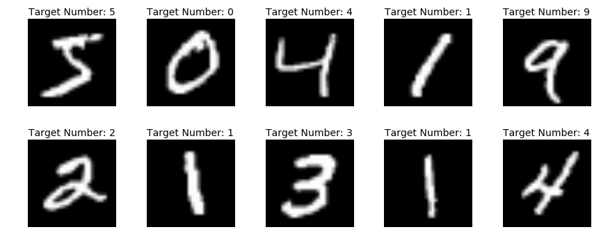
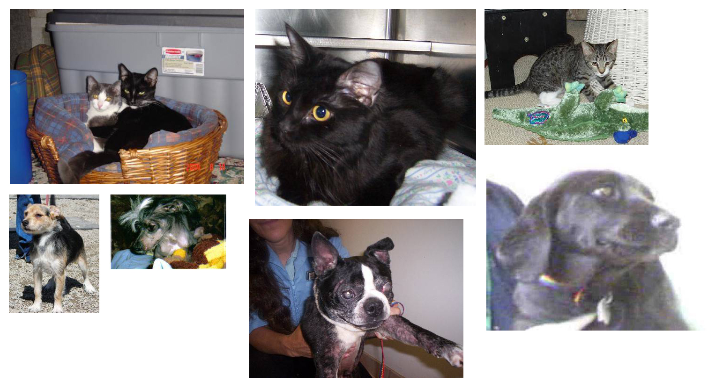

```{r setup, include=FALSE, eval=FALSE}
knitr::opts_chunk$set(echo = TRUE)
```

#Exercise 1

Welcome to Lab 3. In this exercise, we'll learn how to build Convolutional Neural Networks (CNNs) in Keras to classify images.

A CNN is a special type of neural network inspired by the structure of the visual cortex in animals. They can be applied to a wide range of tasks such as image recognition, time-series analysis, sentence classification, etc.

Two key features that differentiate CNNs from fully connected nets are :

1. Local connections: Each neuron in a convolutional layer is only connected to a subset of the neurons in the previous layer.
2. Shared weights: Each convolutional layer consists of multiple filters and each filter consists of multiple neurons. All the neurons in a given filter share the same weights but each of these neurons is connected to a different subset of the neurons in the previous layer.

In machine vision tasks such as image recognition, object detection, etc, CNNs consistently outperform all other models.

## Classifying hand-written digits

The first dataset that we'll be working with is the MNIST dataset (included in Keras). It consists of 28 X 28 (pixel) grayscale images of hand-written digits and their associated labels (0 to 9). The training set contains 60,000 images and the test set contains 10,000.

Sample images :


Let's load the data.

```{r eval=FALSE, include=TRUE}
library(keras)

mnist = dataset_mnist()

#train_images and train_labels form the training set
train_images = mnist$train$x
train_labels = mnist$train$y

#test_images and test_labels from the test set
test_images = mnist$test$x
test_labels = mnist$test$y
```


The images are encoded as 3D arrays (of integers from 0 to 255) and the labels are 1D arrays (of integers from 0 to 9).

The str() function in R is helpful for viewing the structure of the arrays.

```{r eval=FALSE, include=TRUE}
str(train_images)
str(train_labels)
```

```{r eval=FALSE, include=TRUE}
str(test_images)
str(test_labels)
```


### Build the network

Our goal is to build a network that maps an image of a handwritten digit to its target label/digit.

A CNN typically consists of a series of convolutional and pooling layers followed by some fully-connected layers. The convolutional layers detect important visual patterns in the input and the fully-connected layers then classify the input based on the activations in the final convolutional/pooling layer.


Each convolutional layer consists of multiple filters. When the CNN is trained, each filter in a layer specializes in identifying patterns in the image that downstream layers can use.

To create a convolutional layer in Keras, call the `layer_conv_2d()` function and specify the following:

1. The number of filters in the layer (`filters` parameter)
2. The size of the filters (`kernel_size` parameter), and,
3. The activation function to use (`activation` parameter)

Pooling layers are used to downsample intermediate feature maps in the CNN. Keras has multiple options for pooling layers but today, we'll only use `layer_max_pooling_2d()` which takes a `pool_size` argument for the size of the pooling window.

As the name suggests, the layer performs 'max pooling'.


```{r eval=FALSE, include=TRUE}
#https://keras.rstudio.com/reference/layer_conv_2d.html
#Build the first few layers of a CNN with the following stucture
#First conv layer : 32 filters, 3X3 kernel (passed as the vector c(3,3)), relu activation. (Remember to specify the input_shape = c(28,28,1) for the first layer.The last index refers to the number of channels (1 = grayscale images)).
#First pooling layer : 2X2 window
#Second conv layer : 64 filters, 3X3 kernel, relu activation
#Second pooling layer : 2X2 window
#Third conv layer : 64 filters, 3X3 kernel, relu activation

model = keras_model_sequential() %>%
#TODO

```

Let's take a look at what we've built so far:

```{r eval=FALSE, include=TRUE}
summary(model)

```

You can see that the output of every `layer_conv_2d()` and `layer_max_pooling_2d()` is a 3D tensor of shape (height, width, channels). For example, the output of the first layer is a tensor of shape (26,26,32). Note that the width and height dimensions shrink as you go deeper in the network. The number of channels is controlled by the `filters` parameter of the convolutional layers.

Our network isn't quite complete. We have to add some fully connected layers to classify the input image based on the activation patterns in the final convolutional layer.

```{r eval=FALSE, include=TRUE}
#The output of the final conv layer is a tensor of shape (3,3,64). In order to feed this as input to a fully connected (a.k.a. dense) layer, we have to reshape/flatten it from a 3D tensor to a 1D tensor.
#Flatten the model by chaining a layer_flatten() layer to the model that we've built so far and then add two dense layers.
#The first dense layer should have 64 units with relu activations
#The second dense layer should have 10 units(corresponding to the labels) and a softmax activation.


model = model %>%
#TODO

```

Our network is finally complete.

```{r eval=FALSE, include=TRUE}
summary(model)
```

As you can see, the (3, 3, 64) outputs are flattened into vectors of shape (576 = 3 X 3 X 64) before going through two dense layers.

### Data preprocessing

Before training the model we've built, let's preprocess the data by:

1. Scaling the inputs
Recall that the inputs are integer arrays in which the elements take values between 0 in 255. It is standard practice to scale the inputs so that the elements take (float) values between 0 and 1. This typically helps the network train better.

2. One-hot encoding the label
The labels currently are integers from 0 to 9. Because this is a classification problem, we need to one-hot encode the labels (similar to what we did in the previous labs).

```{r eval=FALSE, include=TRUE}
#Recall : The input shape to the conv layer is (28,28,1) where the last index refers to the number of channels (1 = grayscale images)

#Reshape and rescale train_images and test_images.
train_images = array_reshape(train_images, c(60000, 28, 28, 1))
train_images = train_images / 255

test_images = array_reshape(test_images, c(10000, 28, 28, 1))
test_images = test_images / 255

#one-hot encode train_labels and test_labels
train_labels = to_categorical(train_labels)
test_labels = to_categorical(test_labels)


```

### Compile,train and evaluate the model

```{r eval=FALSE, include=TRUE}
#Compile the model using the 'rmsprop' optimizer,  'categorical_crossentropy' loss and the 'accuracy' metric.
#TODO

```

```{r eval=FALSE, include=TRUE}
#Train the model using fit() for 5 epochs with a batch_size of 64
#TODO

```

```{r eval=FALSE, include=TRUE}
#Evaluate the model on the test data (by calling evaluate())
#Save the output to a variable named `results`
#TODO

```

```{r eval=FALSE, include=TRUE}
results
```

The accuracy of our model on MNIST is quite good!


## Exercise 2 : Data augmentation

Having to train an image classification model using only very little data is a common situation, which you likely encounter yourself in practice if you ever do computer vision in a professional context.

Having "few" samples can mean anywhere from a few hundreds to a few tens of thousands of images.

Recall that a large neural network overfits quite severely if it's trained on a small dataset. One simple solution is to artificially increase the size of the training data by creating "fake" data. This is typically done by tranforming the samples in the original dataset in various ways. For example, given a picture of an apple, rotating it by 30 degrees or flipping it around the vertical axis does not change the associated class label(that is, it is still an apple).

To learn how to augment image data in Keras, we'll work with a dataset of images of cats and dogs.

The dataset can be downloaded at 'https://www.kaggle.com/c/dogs-vs-cats/data'. After downloading the zip file, extract train.zip to the kaggle_original_data folder. The kaggle_original_data folder will now contain 25,000 images (12,500 cats and 12,500 dogs).

Here are a few samples from the dataset:


From this dataset of 25,000 images, the code below will create 3 smaller datasets : a training set with 1,000 samples of each class, a validation set with 500 samples of each class, and a test set with 500 samples of each class.

```{r eval=FALSE, include=TRUE}


#Path to the directory where the original data was uncompressed (modify as needed)
original_dataset_dir = "~/Downloads/kaggle_original_data"

#Directory where you'll store the smaller dataset
base_dir = "~/Downloads/cats_and_dogs_small"
dir.create(base_dir)

#Directories for training, validation and test splits
train_dir = file.path(base_dir, "train")
dir.create(train_dir)
validation_dir = file.path(base_dir, "validation")
dir.create(validation_dir)
test_dir = file.path(base_dir, "test")
dir.create(test_dir)

#Directories for training pictures of cats and dogs
train_cats_dir = file.path(train_dir, "cats")
dir.create(train_cats_dir)
train_dogs_dir = file.path(train_dir, "dogs")
dir.create(train_dogs_dir)

#Directories for validation pictures of cats and dogs
validation_cats_dir = file.path(validation_dir, "cats")
dir.create(validation_cats_dir)
validation_dogs_dir = file.path(validation_dir, "dogs")
dir.create(validation_dogs_dir)

#Directories for test pictures of cats and dogs
test_cats_dir = file.path(test_dir, "cats")
dir.create(test_cats_dir)
test_dogs_dir = file.path(test_dir, "dogs")
dir.create(test_dogs_dir)

fnames = paste0("cat.", 1:1000, ".jpg")
file.copy(file.path(original_dataset_dir, fnames),
         file.path(train_cats_dir))

fnames = paste0("cat.", 1001:1500, ".jpg")
file.copy(file.path(original_dataset_dir, fnames),
         file.path(validation_cats_dir))

fnames = paste0("cat.", 1501:2000, ".jpg")
file.copy(file.path(original_dataset_dir, fnames),
         file.path(test_cats_dir))

fnames = paste0("dog.", 1:1000, ".jpg")
file.copy(file.path(original_dataset_dir, fnames),
         file.path(train_dogs_dir))

fnames = paste0("dog.", 1001:1500, ".jpg")
file.copy(file.path(original_dataset_dir, fnames),
         file.path(validation_dogs_dir))

fnames = paste0("dog.", 1501:2000, ".jpg")
file.copy(file.path(original_dataset_dir, fnames),
         file.path(test_dogs_dir))
```

```{r eval=FALSE, include=TRUE}
#To view the number of images in each folder
cat("total training cat images:", length(list.files(train_cats_dir)), "\n")
cat("total training dog images:", length(list.files(train_dogs_dir)), "\n")
cat("total validation cat images:", length(list.files(validation_cats_dir)), "\n")
cat("total validation dog images:", length(list.files(validation_dogs_dir)), "\n")
cat("total test cat images:", length(list.files(test_cats_dir)), "\n")
cat("total test dog images:", length(list.files(test_dogs_dir)), "\n")
```

This confirms that we have 2000 training images, 1000 validation images and another 1000 test images. Each set contains an equal number of dog and cat images.

### Build the network

The network that we'll train here will be similar to the convnet that you built in the first part of the tutorial. Because we're dealing with larger images (150 X 150 X 3) and a more complex problem, we'll enlarge the network by adding an additional convolutional layer + a pooling layer (right before the flatten() layer).

The depth of the feature maps (that is, the number of filters in a layer) progressively increases in the network (from 32 to 128), whereas the size of the feature maps decreases (from 148 × 148 to 7 × 7). This is a pattern you'll see in almost all convnets.

```{r eval=FALSE, include=TRUE}
#Build a CNN with the following structure
#First layer = Conv : 32 filters, 3X3 kernel , ReLU activation. Remember to specify the input shape.
#Second layer = Max pool : 2X2
#Third layer = Conv : 64, 3X3, ReLU
#Fourth layer = Max pool : 2X2
#Fifth layer = Conv : 128, 3X3, ReLU
#Sixth layer = Max pool : 2X2
#Seventh layer = Conv : 128, 3X3, ReLU
#Eighth layer = Max pool : 2X2
#Ninth layer = Flatten
#Tenth layer = Dense : 512 units, ReLU
#Output layer = Dense : 1 unit, Sigmoid (because this is a binary classification task)

model = keras_model_sequential() %>%
#TODO

```

Here's the structure of the network we've built:

```{r eval=FALSE, include=TRUE}
summary(model)

```

```{r eval=FALSE, include=TRUE}
#Compile the model with RMSProp(learning rate parameter `lr` = 1e-4), binary_crossentropy loss and the accuracy metric
#TODO


```

### Data preprocessing

Our data, that is the images, are currently in JPEG format. They must be formatted as floating point tensors before they can be fed to the network.
The steps for getting it into our network are, roughly:
1. Read the picture files.
2. Decode the JPEG content to RBG grids of pixels.
3. Convert these into floating point tensors.
4. Rescale the pixel values (between 0 and 255) to the [0, 1] interval (as you know, neural networks prefer to deal with small input values).

The good news is, Keras has utilies to perform these preprocessing steps automatically. In particular, the `image_data_generator()` function can automatically turn image files on disk into batches of preprocessed tensors.

```{r eval=FALSE, include=TRUE}

# All images will be rescaled by 1/255
train_datagen = image_data_generator(rescale = 1/255)
validation_datagen = image_data_generator(rescale = 1/255)

#Creates a generator for training data
train_generator = flow_images_from_directory(
  # This is the target directory
  train_dir,
  # This is the data generator
  train_datagen,
  # All images will be resized to 150x150
  target_size = c(150, 150),
  batch_size = 20,
  # Since we use binary_crossentropy loss, we need binary labels
  class_mode = "binary"
)

#Build a similar generator for the validation set
validation_generator = flow_images_from_directory(
#TODO
```

Because the batch size is 20, the generators yield batches of 150 X 150 RGB images(shape (20, 150, 150, 3)) and binary labels (shape (20)).

Note that the generator yields these batches indefinitely: it loops endlessly over the images in the target folder.

```{r eval=FALSE, include=TRUE}
#Get the next batch from the generator and view the structure
batch = generator_next(train_generator)
str(batch)
```

### Train the model

Now that we've appropriately preprocessed the image data, let's train the CNN.

In order to use a generator as the input to a network, call `fit_generator()` instead of `fit()`.

1. The first argument is the (training) data generator.

2. Additionally, you have to specify a `steps_per_epoch` argument. Because the data is being generated endlessly, the generator needs to know how many samples to draw from the generator before declaring an epoch over. This is the role of the `steps_per_epoch` argument: after having drawn `steps_per_epoch` batches from the generator -- that is, after having run for `steps_per_epoch` gradient descent steps -- the fitting process will go to the next epoch. In this case, batches are 20-samples large, so it will take 100 batches until you see your target of 2,000 samples. The number of epochs is determined by the value passed to the `epochs` parameter.

3. You can pass the validation generator as the argument to `validation_data`. If you do so, you must also specify the `validation_steps` argument which tells the process how many batches to draw from the validation generator for evaluation.
```{r eval=FALSE, include=TRUE}

#Train the model by calling fit_generator() for 20 epochs. Pass the validation generator as the validation data.
#Set steps_per_epoch =30 and validation_steps = 50.

history = fit_generator(model,
#TODO

```

It's very simple to save a model(that is, both the network structure and the weights) in Keras. The function save_model_hdf5() saves the model in HDF5 format. The model can later be reinstated by calling load_model_hdf5().


```{r eval=FALSE, include=TRUE}
#Save the model
save_model_hdf5(model,"cats_and_dogs_small_1.h5")

```

Let's plot the loss and accuracy during training:

```{r eval=FALSE, include=TRUE}
plot(history)
```

As you can see, the training accuracy is almost 100% but the accuracy on the validation set is much lower. Therefore, the network has clearly overfit. This is to be expected because we only trained the network on a small dataset of 2000 samples.

### Using data augmentation

As explined earlier, data augmentation works by articially enlarging the training set by applying transformations to images that don't change the class labels of the images.

In Keras, this can be done by configuring a number of random transformations to be performed on the images read by an image_data_generator().

Here are some of the transformations available:
1. `rotation_range` is a value in degrees (0-180), a range within which to randomly rotate pictures.
2. `width_shift_range` and `height_shift_range` are ranges (as a fraction of total width or height) within which to randomly translate pictures vertically or horizontally.
3. `shear_range` is for randomly applying shearing transformations.
4. `zoom_range` is for randomly zooming inside pictures.
5. `horizontal_flip` is for randomly flipping half of the images horizontally -- relevant when there are no assumptions of horizontal asymmetry (e.g. real-world pictures).
6. `fill_mode` is the strategy used for filling in newly created pixels, which can appear after a rotation or a width/height shift.

```{r eval=FALSE, include=TRUE}
#Configure a data generator to transform the original data by scaling by 1/255 using the `rescale` parameter, rotating (up to 40 degrees), translating vertically and horizontally (up to 0.2), shearing and zooming (up to 0.2), flipping horizontally (boolean argument) and set fill_mode = "nearest".

datagen = image_data_generator(
#TODO
)

```

Let's view the augmented images.

```{r eval=FALSE, include=TRUE}


#We pick one image to "augment"
fnames = list.files(train_cats_dir, full.names = TRUE)
img_path = fnames[[2]]

#Convert it to an array with shape (150, 150, 3)
#image_load and image_to_array are functions in Keras
img = image_load(img_path, target_size = c(150, 150))
img_array = image_to_array(img)
img_array = array_reshape(img_array, c(1, 150, 150, 3))

#Generator that will flow augmented images
#Note: the generator only yields 1 image at a time
augmentation_generator = flow_images_from_data(
 img_array,
 generator = datagen,
 batch_size = 1
)

#Plot the first 4 augmented images
op = par(mfrow = c(2, 2), pty = "s", mar = c(1, 0, 1, 0))
for (i in 1:4) {
 batch = generator_next(augmentation_generator)
 plot(as.raster(batch[1,,,]))
}
par(op)
```

The most important thing to note here is that when you transform the data in this way, the network will never see the same input twice because the tranformations applied to the data are random (within the predefined range). While this reduces the degree of overfitting by increasing the number of data points that the network is trained on, it can still overfit because the transformed images are still heavily correlated. Therefore, let's add a dropout layer to the network to further regularize it.

```{r eval=FALSE, include=TRUE}
#Build a new model by adding a dropout layer (with a rate of 0.5) just before the first fully connected layer (that is, after flatten) in the CNN we built earlier (in this exercise)
model = keras_model_sequential() %>%
#TODO


#Compile the model with RMSProp(lr = 1e-4), binary_crossentropy loss and the accuracy metric
#TODO
```

### Train the model

```{r eval=FALSE, include=TRUE}


#Once again, configure the generator to transform the training data almost exactly as we did previously. This time, don't specify fill_mode.
datagen = image_data_generator(
#TODO

#Configure the generator for the test data.
#Note : We only rescale the images in the test data by 1/255. No other transformations are applied.
test_datagen = image_data_generator(
#TODO

#train_generator should yield 32 images per batch.
#Remember to set the target_size and class_mode (exactly as we did previously)
train_generator = flow_images_from_directory(
#TODO

#Validation_generator should also yield 32 images per batch
#Again, remember to set the target_size and class_mode
validation_generator = flow_images_from_directory(
#TODO

#Train the model using fit_generator for 100 epochs
#Set steps_per_epoch = 100 and validation_steps = 50
history = fit_generator(model,
#TODO
```

Save the trained model:

```{r eval=FALSE, include=TRUE}
#Save the model to a file named cats_and_dogs_small_2.h5
#IMPORTANT : You'll need this saved model in the next lab!
#TODO
```

Plot the results :

```{r eval=FALSE, include=TRUE}
plot(history)
```

The plot shows that adding data augmentation and dropout have clearly helped. We are no longer overfitting: the training curves are rather closely tracking the validation curves.

That's the end of this lab. Next time, we'll look at more ways to get the most out of small datasets.

See you then!
